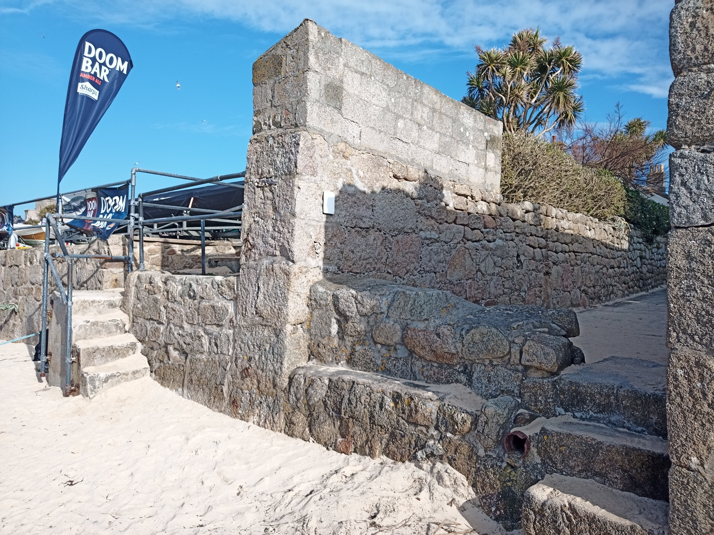
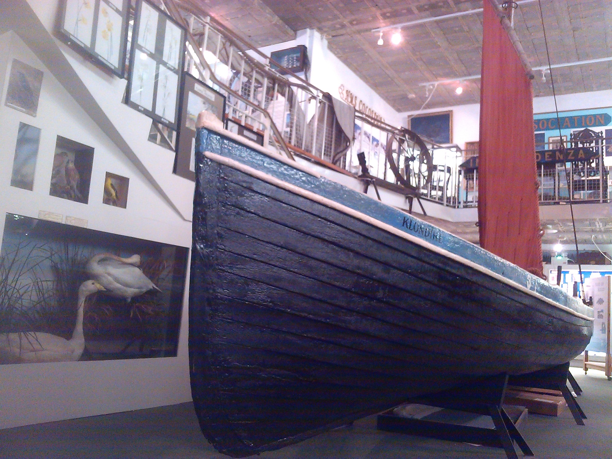
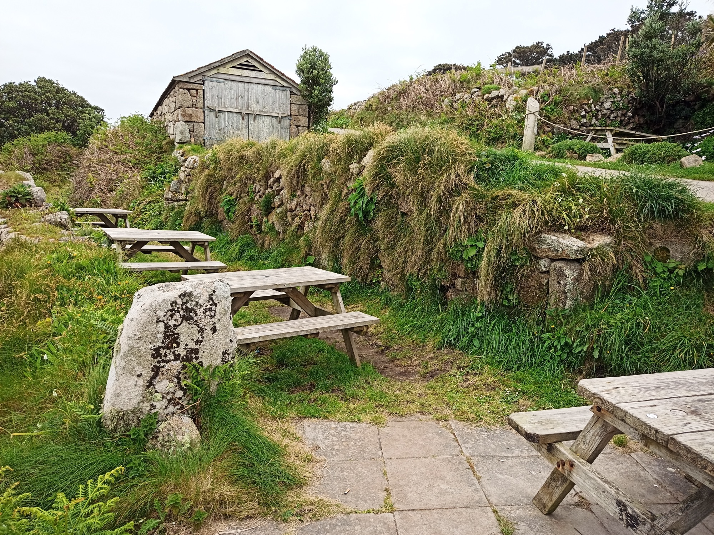

# Around Hugh Town, St Mary’s
## Archaeology of the building of pilot gigs

The traditional design of gigs, evolved in Scilly and Cornwall, was particularly suited to running into a head sea, helping pilots reach sailing ships driven on the prevailing westerly winds. It was developed further by Cornish master builder William Peters in the early 19th century at Polvarth, St Mawes. Peters made all the historic gigs preserved on Scilly (mostly taken to Newquay and restored c.1954), and many more formerly kept on the islands. He also supplied to Newquay in 1838 the gig _Treffry_, whose lines are used as the model for racing gigs today (**Photo 1**).

_1: Historic gigs from Scilly, taken to Cornwall in 1954; Slippen and Bonnet originally kept at Par Beach, St Martin’s ─ Slippen later went to St Agnes, and Bonnet to Bryher and Tresco ─ and Golden Eagle kept at Great Porth, Bryher (where Bonnet joined her). ICS12/2280, Gigs, Newquay Harbour, 1956 **© Charles Woolf Slide Collection, University of Exeter Penryn Campus**_

Pilot gigs were also built on St Mary’s; in addition to sailing ships, dozens of which were commissioned and operated by owners on Scilly in trading ventures around the world in the mid-19th century. One shipyard, taken on in 1875 by William Gluyas (1841-1923) from his uncle William Mumford, lay above Town Beach opposite his uncle’s Lyonesse House on Lower Strand.

Traces of Gluyas’ yard are visible at Holgates (named after a later hotel that once stood here) where gigs are stored annually for the racing championships. An 1862 map shows the wall against an alley, at the townward end of Holgates Green, that once formed one side of shed in the yard (**Photo 2**). Gluyas built a gig in 1877 for St Mary’s coastguards, the _Klondyke_, conserved in Scilly’s Museum collection (**Photo 3**). Plans for restoration and display of Klondyke as part of a renewed museum and cultural centre are now in development.

_2: Edge of the old boatyard of William Gluyas, builder of the gig Klondyke, now part of Holgates Green. The wall against the alley with concrete top, and the later steps with modern rails, mark where the two long sides of one of the sheds of Gluyas’ day ran back to end at the Strand._

_3: The 1877 gig Klondyke in Scilly’s old Museum. Alfred Jenkins noted her sails were from Czar._

_Klondyke_ was sold to St Agnes for lighthouse tendering work. Sheds where she was kept at different times survive as walled platforms, at Porth Conger. They lie either side of the road, downhill from the present _Shah_ shed (thanks to Marigold Hicks for information) (**Photo 4**).

_4: Sites of sheds, now roofless walled platforms, once used for the Klondyke, either side of the road at St Agnes, near the Turk’s Head pub (a former coastguard station with its own slipway). The shed now housing Shah, rebuilt in old style, stands above; a slipway slants down left of it._

More recently, Tom Chudleigh used a converted glasshouse in a yard behind the Strand, on Wellcross Lane, to build racing gigs for Scilly (**Photo 5**). These include St Mary’s _Serica_ (1967) ─ using lines of the old gig _Bonnet_, as noted by Alfred Jenkins ─ and St Martin’s _Dolphin_ (1969).

_5: Tom Chudleigh’s yard on Wellcross Lane where he built gigs in the 1960s, with the head of the old Rechabite slip used by earlier boatbuilders below it across the Strand. To the right (north) of the slip, traces of the front of a former shed, in the sea wall, mark where the gig Leo was kept._

At St Mary’s present boatyard, at Porthloo, parts of old gigs replaced during past repair work are preserved by Andrew Hicks (**Photo 6**). Thanks to Andrew, a selection of these pieces was included in the _Porths and Gigs_ scanning and modelling work.

_6: Andrew Hicks with parts from past repairs to the Czar - a knee that held the no. 1 thwart, and a piece with thole pin holes from under the gunwale at one of the rowing positions._

Pieces from pilot gigs were preserved by other builders too, notably Ralph Bird of Devoran. St Agnes’ new racing gig, _Cetawayo_ **link to Peraskin page** has laminated wood conserved from a different old gig, recorded by name, fitted in each section (builder Patrick Bird, pers. comm.).

Archaeology could reveal more about gig building and their materials, predominantly elm (**Photo 7**). Their age could be investigated by tree-ring pattern dating or by oxygen isotope analysis (Cathy Tyers, Historic England, pers. comm.). Elm cut for boatbuilding is sometimes found buried in mud, in the Fal estuary near St Mawes. Gig builders, like the Peters, would season timber in the creeks for 4 or 5 years. On Scilly, archaeological remains of gigs themselves could potentially survive, through burial in sand, for example. As historic maps show, sites of many gig sheds now lie under dunes, like a whole group on the west of the green at Periglis, St Agnes.

_7: Elm from St Mary’s Holy Vale, at Porthloo boatyard, showing its dense grain; elm was once prolific on the Roseland, where most of the old gigs now surviving on the islands were built._

An exciting recent discovery, at St Agnes, is part of a gig used as panelling in a house (thanks to Harry and Tamaryn Legg). Harry has identified the piece as probably part of the gig _Bee_, apparently based on St Agnes by 1841 when she went out to the fatal wreck of the _Thames_ on the Western Rocks (as recorded by Alfred Jenkins). The early elm planking and paint of the piece have great archaeological potential (**Photo 8**). It may be that more remains of this kind survive, in other contexts, since re-use and adaptation of material is a strong island tradition.

_8: Harry Legg with the part of a gig he discovered and identified as the Bee built in 1838, which had been re-used as panelling at St Agnes._

The virtual 3D models of gig components presented here were made courtesy of Andrew Hicks of Porthloo boatyard.

**Sources**

Jenkins, AJ, 1975. _Gigs and Cutters of the Isles of Scilly_. Integrated Packing Group Ltd. and the Isles of Scilly Racing Committee

Larn, R, and Banfield, R, 2013. _Built on Scilly The history of shipbuilding on the Isles of Scilly between 1774 & 1891_. Shipwreck & Marine: St Mary’s

Williams, Captain G, 1862. _Plan of St Marys Town_ at UK Hydrographic Office (ref. D6365 Oh.)

2024 ‘History of Pilot Gigs on the Roseland’, talk by Milly Edwards (Roseland Gig Club chairman)
