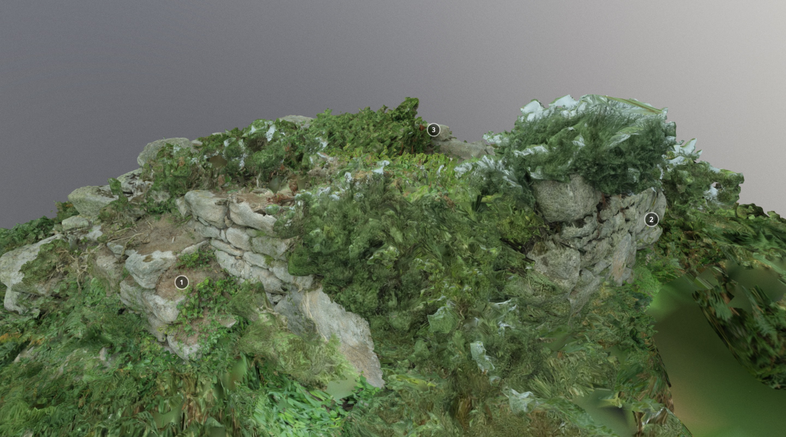

**Porths and Gigs of the Isles of Scilly: [Home](index.md) &#124; [The Project](project.md) &#124; [Around Hugh Town](around-hugh-town.md) &#124; [Innisidgen, St Mary's](innisidgen-st-marys.md) &#124; [New Quay, St Mary's](new-quay-st-marys.md) &#124; [Peraskin, Agnes](peraskin-st-agnes.md) &#124; [Great Par, Bryher](great-par-bryher.md) &#124; [Beacon Hill, Tresco](beacon-hill-tresco.md) &#124; [Signal Rock, St Martin's](signal-rock-st-martins.md)** 

# Beacon Hill, Tresco
## Hilltop platform that once had a mast for pilots to signal to ships

North of New Grimsby, on the highest point of Tresco at 40m OD, is a rare type of lookout, with a strong platform and the recorded site of a signal mast (**Photo 1**). It stands in one of Scilly’s largest Scheduled Monuments, an area of 101 acres, on the ridge of Castle Down crowned by Beacon Hill. The name of the hill probably refers to a lost fire beacon site, likely to have had some association with the artillery forts nearby, King Charles’ Castle and Cromwell’s Castle.

_1: Top of the Beacon Hill lookout. The wall, centre, may mark a stepping back of the top of the platform when it was rebuilt, to avoid building out to the original edge. The view, looking north east, takes in Round Island (in the centre behind St Helens) and St Martin’s (to the right beyond Teän)._

The same Scheduling also contains other archaeology, Bronze Age to post-medieval in date. This includes a rectangular platform defined by a low bank on the ridge above Gimble Point, resembling the ‘turf steads’ found on Cornish moors such as those on the Lizard. These held cut ‘turf’, slabs of the peaty surface of the down, skimmed off and dried in summer. 

Turf was the main winter fuel, together with furze (gorse) and driftwood. Ricks were also made to store ferns (bracken) for animal bedding, and one on the Neck of Samson has a particular significance for the story of how the Bryher crew of the gig _Albion_ saved lives from the wreck of the _Delaware_ in 1871, investigated in the _Porths and Gigs_ report.

Here on Beacon Hill, some time before _c_1750, a ship’s captain donated a mast to be set up so that pilots could show by raising ‘colours’ (flags) that they were putting out (in response to ships signalling for a pilot with colours and guns). Flag signalling was customary for pilots, who flew their own pennants on ships where they worked, enabling their crews to take them off afterwards (Fraser Hicks, pers. comm.). The views from the Beacon Hill platform are wide, as shown by the 360° panorama (**Photo 2**). However, the mast here was actually used more as a mark for the entrance to New Grimsby harbour, and it was disused before the end of the 18th century.

_2: Panorama showing the horizon around 360° from the top of Beacon Hill lookout. Tresco’s New Grimsby is visible towards the left in the middle ground, with St Mary’s and St Agnes on the horizon to either side of it. Bryher is skylined beyond the conifer plantation further to the right. Tresco’s King Charles’ Castle stands out on the crest of heathy Castle Down, right of centre. St Martin’s is visible far right, and also far left with the Eastern Isles._

A disaster a few decades later showed the deadly risks when signalling failed. During the gales, almost incessant, of winter 1822-1823, a ship appeared off the back of Tresco, flying colours for a pilot. A Bryher gig took a pilot out and put him on the ship, but the signal flag was not lowered. A Tresco gig, crewed by a branch-pilot (Trinity House licensed) and four other men, pulled out. As the gig came close to the ship, within two ship’s lengths, a tremendous sea overturned it.

The Bryher pilot begged the ship’s captain in vain to lower a boat, or go about. Three of the Tresco crew were drowned; the other two men were taken up by a second gig from Tresco and brought back to the care of the surgeon there, Mr Molloy (_Royal Cornwall Gazette_, April 5 1823, 4). 

The 3D model of the Beacon Hill lookout reveals traces of how it was made and adapted over time. Features were freed of low scrub ready for the scanning, thanks to Scilly’s Community Archaeology Group (CAG) (**Photo 3**). Gorse bushes were left standing, as the area is a Site of Special Scientific Interest, and the gorse may be a refuge for birds.

_3: Beacon Hill lookout, prior to scrub control by CAG volunteers that contributed greatly to the clarity of the 3D model (photo courtesy of CAG leader Katharine Sawyer)._

The late 18th century account says the site had ruins of a round tower. This could have stood on the ground or on the platform. Possibly it was similar to a rounded lookout on a rectangular plinth at the naval signal station of 1794 on Dodman Head, on the south coast of Cornwall east of Falmouth (**Photo 4**). This is more the height of a pulpit than a tower, but with its stepped-up base it opens up wider views. Its shell of walling, large enough for a couple of people, has remains of an iron fitting to steady a telescope.

_4: Lookout used later by the coastguard, at the 1794 flag signal station on Dodman Point, one of a chain running along the south coast. Beyond the gap between the lookout and watch house is one of the stones with iron loops for stays holding a signal pole in the centre of the plot. The station on St Martin’s Chapel Down, too distant to link directly to the chain, signalled to ships. The pilots of Scilly served the information networks, taking news and mails to and from ships._

Pilots using the Beacon Hill lookout may have worked out of New Grimsby or Old Grimsby to either side. The 1887 map shows traces of an old route to Point, New Grimsby. Two paved slipways remain there (**Photo 5**), at the site of the gig sheds seen in the 1862 painting on the website front page. The _Zelda_ of 1874 was once kept here (Richard Jenkins, Bryher, pers. comm.). Gig crews elsewhere on Tresco could use carns to keep watch and signal, as no doubt at Carn Near where the gigs _Gleaner_ and _Longkeel_ were kept (Joby Newton, pers. comm.) (**Photo 6**).

_5: Looking down the slab slipway at Point, New Grimsby. The slipway, made double width to serve the pair of sheds above, was still in use when painted in 1862 (website front image)._

_6: Carn Near at the other end of Tresco. A hollow in the ferns left of centre, slanting down to the track to Bathinghouse Porth, marks a ruined shed. The site was used to house the gigs _Gleaner_ and _Longkeel_ (Joby Newton, pers. comm.) and before that a Tresco Estate boat, _Normandy_._

The Beacon Hill scanning was carried out courtesy of landholders the Tresco Estate.

## 3D models

[View the 3D model on Sketchfab](https://sketchfab.com/3d-models/beacon-hill-tresco-e1932f6044404ffabdfca94ec9168b4f) where you can click the annotations to find out more about the different parts of the complex. The annotations are included below for reference.

**(1)** Steps are built into the lookout, so watchers could climb this south, lee side. In the 1970s, when vegetation was lower, some walling, perhaps part of a lean-to shelter, was seen at ground level. The platform, faced with granite slabs and filled with ram (subsoil) and rubble stone, is 2m high.

With the extra height, significantly more sea appears above Castle Down. As the 360° panorama shows, the view takes in parts of all the main islands; as well as the closer islets of Northwethel, St Helen’s, and Teän, with Round Island and its lighthouse behind them.

Skyline sites include Telegraph on St Mary’s, marked by its modern mast. The stone tower there was built before the time of the telegraph, in the early 19th century, to support a semaphore mast with wooden arms, mounted on its roof. The semaphore replaced the Napoleonic flagpole station near the Daymark on St Martin’s, visible from that island’s early lookout at Higher Town shown in another 3D model, which unlike this Tresco site used a natural carn.

**(2)** Several facing stones, on the north east side of the platform, have marks showing they were cut rather than simply natural ‘moorstones’. CAU surveys elsewhere have found that ‘broad drill marks’ like this, or BDMs as they’re known, were commonly used for splitting stone, later than ‘wedge marks’, and before ‘narrow drill marks’. As some splitting marks occur in documented buildings, they can be dated, and this type is generally early-mid 19th century. 

One of the other BDMs here is in a stone near the base of this same revetment, so the lookout was probably refurbished at some point during that period, most likely after 1822 since Woodley described the site as ruinous at that date. 

The re-building of the lookout was probably done for the Preventives, or Customs and Excise Service, who had taken over the site in Woodley’s day to help detect smuggling vessels, including gigs. By the time of the OS map of 1887, which labels the site as ‘Disused’, smuggling on Scilly was largely suppressed.

**(3)** Two rows of stones run across the top of the platform, back from the edge, towards the north side. The straighter edges of the stones are aligned, forming the opposing faces of a wall (which had a ram core, part weathered away).

The stones resemble those of the outer revetment, but rise from a tumbled part of it, and the walling is less regular than the facing. This indicates the wall relates to the later phase of the lookout _c_1822-1850, replacing its original north side presumably to save work. When full height, it could have given shelter to the Preventives, who may also have had a roofed lean-to refuge against the platform, accessible down the steps.

Archaeology of the previous phases of the site may lie under the bushes and/or under the surface. The flagpole recorded in the mid-18th century probably had a socket slab set into the surface and guy hooks fixed to other stones. Potentially, a pocket of distinctive soil representing the pole base could survive, if the mast was left to decay _in situ_.

## Sources

Borlase, W, 1756. _Observations on the Ancient and Present State of the Islands of Scilly_. Facsimile edition 1966. Frank Graham: Newcastle

Gibson and Sons, _c_1932 (undated). _The Isles of Scilly_. Gibson & Sons: Isles of Scilly

Troutbeck, J, 1796. _A Survey of the Ancient and Present State of the Scilly Islands_: Sherborne

**Porths and Gigs of the Isles of Scilly: [Home](index.md) &#124; [The Project](project.md) &#124; [Around Hugh Town](around-hugh-town.md) &#124; [Innisidgen, St Mary's](innisidgen-st-marys.md) &#124; [New Quay, St Mary's](new-quay-st-marys.md) &#124; [Peraskin, Agnes](peraskin-st-agnes.md) &#124; [Great Par, Bryher](great-par-bryher.md) &#124; [Beacon Hill, Tresco](beacon-hill-tresco.md) &#124; [Signal Rock, St Martin's](signal-rock-st-martins.md)** 

Woodley, G, 1822. _A View of the Present State of the Scilly Islands_. SPCK: London
