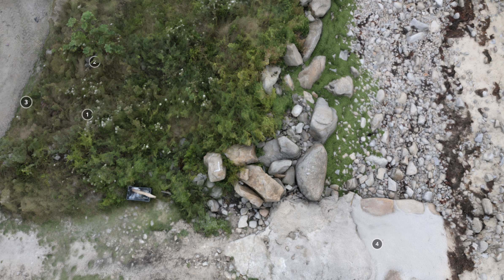
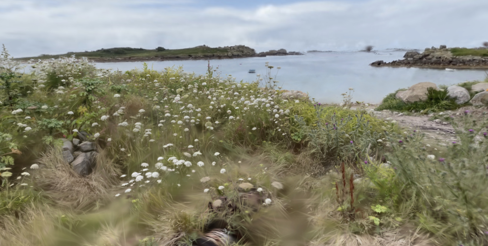

**Porths and Gigs of the Isles of Scilly: [Home](index.md) &#124; [The Project](project.md) &#124; [Around Hugh Town](around-hugh-town.md) &#124; [Innisidgen, St Mary's](innisidgen-st-marys.md) &#124; [New Quay, St Mary's](new-quay-st-marys.md) &#124; [Peraskin, Agnes](peraskin-st-agnes.md) &#124; [Great Par, Bryher](great-par-bryher.md) &#124; [Beacon Hill, Tresco](beacon-hill-tresco.md) &#124; [Signal Rock, St Martin's](signal-rock-st-martins.md)** 

# Great Par, Bryher
## Sheds of renowned gigs, worked by rival groups of pilots

The _Czar_ is the only historic gig on Scilly that has never been kept away from the islands, and continues to be rowed and raced here today (Tresco & Bryher Gig Rowing Club website) (**Photos 1** & **2**). Built by Peters in 1879, she was originally fitted for seven oars; a Victorian renewal of an old St Mawes tradition, reaching back 400 years, of 7- or even 8-oared gigs, banned in Georgian times for their potential for use by smugglers to evade excise vessels.

_1: _Czar_ attended the wreck of the _Minnehaha_ in 1910, saving live cattle, seen here swimming alongside the gig. The cattle were secured by ropes to the thole pins (Fraser Hicks, pers. comm.). Photograph by Gibson **© National Maritime Museum, Greenwich, London**._

_2: _Czar_ racing over a century later; thanks to Aaron Haile and Jonathan Taylor for the photo._

_Czar_ was formerly kept at Great Par, or Porth. Gig sheds once stood in three places, spaced around the north half of the par, serving rival pilotage concerns (**Photo 3**). Dispersed sheds (or clusters of them) elsewhere, as at Peraskin, St Agnes, may again have belonged to different shareholding groups. Sheds were also placed to make use of the relative shelter afforded by corners of beaches.

_3: The northern beach of Great Par as it’s called on Scilly, or porth, seen from Great Carn. The corner of the beach to the front right may also have had a gig shed (as discussed in the report)._

The old _Czar_ shed is now a Scheduled Monument. This low site is especially vulnerable to the sea. It has sand and stones cast up on it, and boulders placed on its front to keep the waves back. The _Porths and Gigs_ plan, made with the help of volunteer trainee Layan Harman, shows the long walls, and the lack of an inner end wall due to the unusual use of double doors at each end (**Photos 4** and **5**). Slipways alongside and in front served the two ends (**Photos 6** and **7**). 

_4: Surveying the _Czar_ shed site, by taking measurements offset at right angles from a baseline tape, a method allowing rapid accurate survey of smaller sites with minimal equipment._

_5: Plan of the Czar shed, with the site of a slipway in front, and the concrete slip still in use alongside that would have formerly given access to the back doorway of the shed._

_6: _Czar_ shed after vegetation control in 2023, with the hollow way to the concrete slip (right).

_7: _Indications of a slip below the_ Czar _shed (arrowed, spanning the foreground) in 2019. Some stones appear to have been laid with one side aligned, similar to those edging old slipways._

The roof survived until *c*1960, appearing in a rare close-up photo (**Photo 8**). It was thatched with rushes or reeds from pools and inlets (Chris Potterton, pers. comm.). It appears to have had bundles of thatch not fully secured by a rope net in the traditional way (as seen in the 1862 painting on the front website page), probably because they represent repair late in the lifetime of the shed.

_8: The landward end of the _Czar_ shed, seen from the south, around the middle of the 20th century when it was still maintained. Courtesy of the Isles of Scilly Museum (ref. no. RN07507)_

In the 1960s the _Czar_ was kept in the _Eagle_ shed to its south, which was roofed with thatch, then tiles, then corrugated iron, before being restored with tiles on conversion to a studio (Nick Jenkins, Richard Pearce and David Stedeford, pers. comms.). Red ‘Double Roman’ tiles are traditional, being used on Scilly from before 1800; they were shipped from Bridgwater, Somerset (**Photo 9**).

_9: The _Golden Eagle_ shed restored as an artist’s studio, further south on Great Porth. The _Czar_ shed site lies by the slipway visible to the left._

To the north is the site of the double shed of the 1844 gig _Albion_, and probably the _March_ (Richard Jenkins, pers. comm.). The shed is not apparent now on the ground, but is unforgettable as the site from which an astonishing rescue was carried out in 1871 (**Photos 10** and **11**).

![A panoramic view of the coastal landscape featuring wildflowers, grasses, and the bay and rocks beyond])(website-images/Bryher-Czar-Great-Porth/10-czar-shed-panorama.jpg)

_10: Panoramic view of the northern half of Great Porth. The base of the _Czar_ shed lies in the wild flowers in the foreground; the _Albion_ shed site is to the far right._

_11: Former site of the double shed of the _Albion_ and probably _March_, to the north on Great Porth (thanks to Richard Jenkins for information). These sheds were those from which the gigs were carried nearly half a mile, even before the rescuers left Bryher, to save lives from the sea in 1871._

The Liverpool steamer _Delaware_ foundered near Mincarlo, west of Samson, in a foul winter gale (_Cornish Telegraph_, December 27 1871, 2-3). A Bryher crew carried their gig (identified by local tradition as _Albion_) from here to Rushy Bay at the south end of the island, pulled across to Samson, carried _Albion_ across the Neck of Samson, launched again into ‘furious waves, shoulder-deep’, and pulled on westward to White Island, to reach the two survivors who’d been driven there from the wreck on a broken lifeboat.

The _Albion_ crew pulled back to Samson, wrapped the men in ferns as well as some of their own clothing, and swaysed (signalled by waving a jacket) from North Hill for the _March_ to pull across from Bryher. They then pulled the _March_ back to Bryher, taking the two survivors to be cared for in the nearest house. (The _March_ crew later carried _Albion_ back across Samson from West Porth before returning home.)

The _Albion_ men who achieved this humanitarian feat were Richard Ellis, James Jenkin, junior, Stephen Woodcock, and John Webber; William Woodcock, William Jenkin, John Jacob Jenkin, Thomas Bickford, and Sampson Jenkin, and cox’n Patrick Trevillick, aged 21 to 50. (The _Porths and Gigs_ project report gives more details, from the contemporary accounts.)

The OS map of 1888, highly accurate and detailed, marks a feature at the north end of Great Porth, with a position, orientation, and span consistent with its being the landward gable end of one half of the double shed. This would fit with the memory on Bryher of a ruined wall having been visible at that shed site through the 20th century (Richard Pearce, pers. comm.).

It is not clear if anything now remains at the double shed site. Comparing the modern map and the 1888 survey, it appears that the gable left in 1888 may have stood just behind the line of the modern sea defences (where the ground has been dug out and then built up higher with rock armour) ─ so there could be some possibility of survival of the base of that gable.

The panorama seen from the _Czar_ shed site takes in the hazardous rocks in the open sea beyond, including Mincarlo near which the _Delaware_ struck (the islet with undulating profile, on the skyline beyond the south side of the opening of the porth) and the taller, steeper Castle Bryher.

## 3D models

### Czar gig shed

[View the 3D model on Sketchfab](https://sketchfab.com/3d-models/czar-gig-shed-bryher-isles-of-scilly-dbf8ec2c38464f30a78ea0b9c3867942) where you can click the annotations to find out more about the different parts of the complex. The annotations are included below for reference.

**(1)** The interior of _Czar_’s shed can be seen, and felt underfoot, despite vegetation growth, forming a distinct strip south of slipway (4). The actual floor lies under blown sand. The _Eagle_ shed nearby had beach cobble flooring (Richard Pearce, pers. comm.)

A winch in the grass here is unrelated to the use of the shed. Early gigs were broader and heavier, but the traditional fine elm planking used also in today’s racing gigs (like that in the model from _Nornour_) meant they could be carried by a crew of 7 ─ each bearing a load of over 1 cwt or 50 kilos.

The track just behind the sheds is the route used to carry Albion nearly half a mile to launch at Rushy Bay at the start of the 1871 rescue. It had developed to serve the sheds, linking them to hilltop lookouts and to the dwellings, concentrated to the east in 1792 but established here at Pool before 1888 as old maps show. _Czar_ was sometimes secured to a tree east of the track, to prevent damage when gales struck at high tides (Gerald Langdon, pers. comm).

**(2)** Side wall of the _Czar_ shed. This is clearer than the north wall against slipway (4). It rises a little higher, and has more stone visible. The bases of the walls, like the floor, are buried in stabilised blown sand and tumbled stones.

As shown by the mid-20th century photo of this site, originally the sides of the shed rose to _c_1.5m or shoulder high. Their stonework appears to have been more irregular than that seen in the sheds seen in another of the _Porths and Gigs_ models at New Quay, St Mary’s, still near-intact.

Sheds in the past, like those of today, would have had gear stored against their walls, on wall tops, and hanging in the roof timbers or laid on planks across them. Old houses and barns had neat ‘keeping places’ built into their walls, as can be seen on Samson, but these were probably not usual in early gig sheds with their less regular stonework. A ruined gig shed on the Neck of Samson with a small timber lean-to store at one end, _c_200 years old, is explored in the _Porths and Gigs_ report.

**(3)** The lack of an inner end wall is part of the design of the shed, known for having had double doors at each end. This design may have been innovative for a gig shed. Sheds opening only to landward are known to occur, where winds laden with sand could hamper launch and recovery ─ as can be seen for instance from the walling of a roofless shed at Green Porth, Old Grimsby, Tresco (in the project report).

St Mary’s first lifeboat house, founded in 1874, now the library, had doors at both ends, to allow launching at Town Beach behind as well as Porth Cressa in front. Possibly this design feature was adopted from there for this shed, if it was newly built (or rebuilt) when the _Czar_ was made in 1879. Here it would let the _Czar_ pass through whichever end was better to use in the weather and sea conditions, as well as helping to move her back from the shed to be secured away from storm surges if needed.

The shed is remembered as having borne the name _CZAR_ on a timber above its doors (Richard Pearce, pers. comm.).

**(4)** This concrete slipway alongside replaces an original slip; the hollow way running to it has possible stone surfacing and, like the shed, was mapped in 1888. It was linked to the double doors at the back of the gig shed via the track there.

On the beach immediately west of the shed, stone edging, indicating a separate front slipway, has been visible at times. This may now have gone, as sea defences in this area have been renewed.

Further down, the beach is largely free of boulders, and the map of 1888 shows it was similar at that time. This meant there was no need to make a drang to pass through the inter-tidal zone.

Some other shores, close to the open sea, change greatly with shifting beach material. Porth Minick, St Mary’s, has no signs of use by gigs, despite proximity to Old Town. Its sand is quite recent, not shown on the maps of 1906 or earlier, and its Cornish name means ‘Stony Porth’. It may be that boulders were so dense and mobile there that clearing a passage for gigs was not feasible.

### Czar shed and setting

**‘NeRF’ model of the setting of the** **_Czar_** **shed on Great Porth**. 

[View the interactive photo (NeRF) on Luma AI](https://lumalabs.ai/capture/f95013a5-f196-416f-893f-59e3ff790c26). Click or tap to stop the animation and drag and pinch to explore it.

To the south is the red-tiled roof of the _Golden Eagle_ shed restored as a studio, once thatched like this shed and similar in age.

On the far south side of Great Porth, a thin neck of land runs out west to Heathy Hill. Beyond the neck, on Stony Porth is the possible site of a shed with some bits of red tile. An old photo shows a feature resembling a roof there (Richard Pearce, pers. comm.). If a gig shed, this was not standing _c_1888-1906 as the maps of those dates do not show it (see the project report for this and other possible sites).

To the north was the earlier shed of the _Albion_, renowned for the 1871 _Delaware_ rescue (thanks to Richard Jenkins for information). It was gone before 1888, but part of its gable end remained in living memory (Richard Pearce, pers. comm.). It stood beyond a concrete drain, which runs from the Pool behind that gave its name to the hamlet here established in the age of pilotage.

**Porths and Gigs of the Isles of Scilly: [Home](index.md) &#124; [The Project](project.md) &#124; [Around Hugh Town](around-hugh-town.md) &#124; [Innisidgen, St Mary's](innisidgen-st-marys.md) &#124; [New Quay, St Mary's](new-quay-st-marys.md) &#124; [Peraskin, Agnes](peraskin-st-agnes.md) &#124; [Great Par, Bryher](great-par-bryher.md) &#124; [Beacon Hill, Tresco](beacon-hill-tresco.md) &#124; [Signal Rock, St Martin's](signal-rock-st-martins.md)** 
