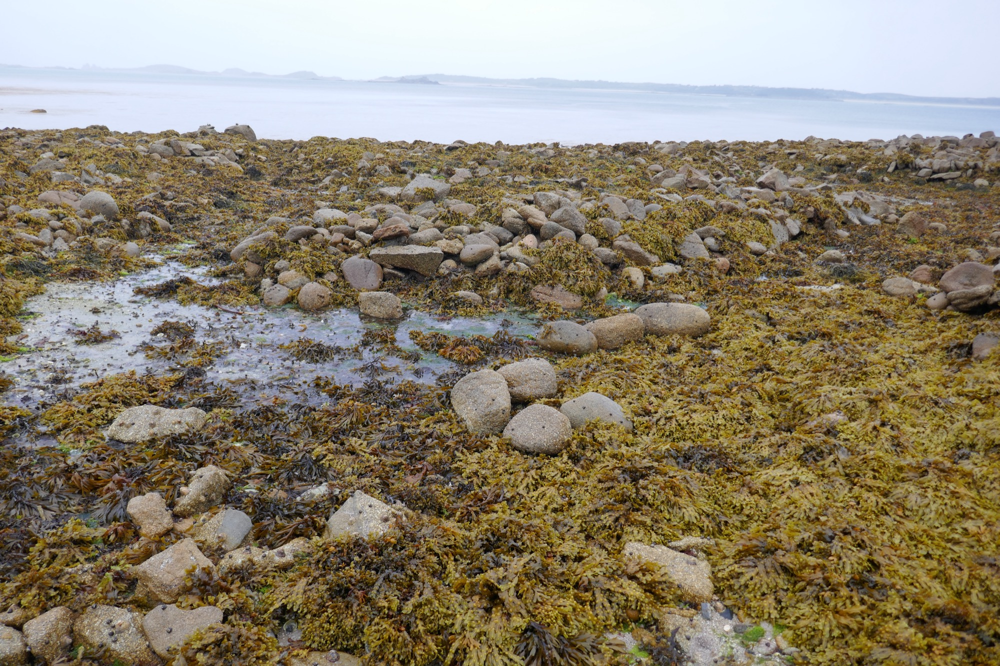
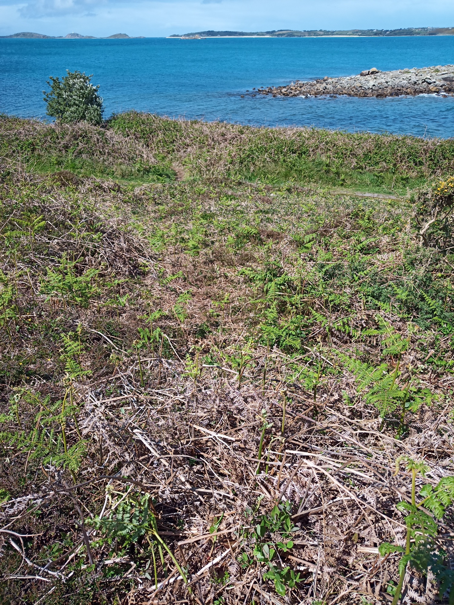
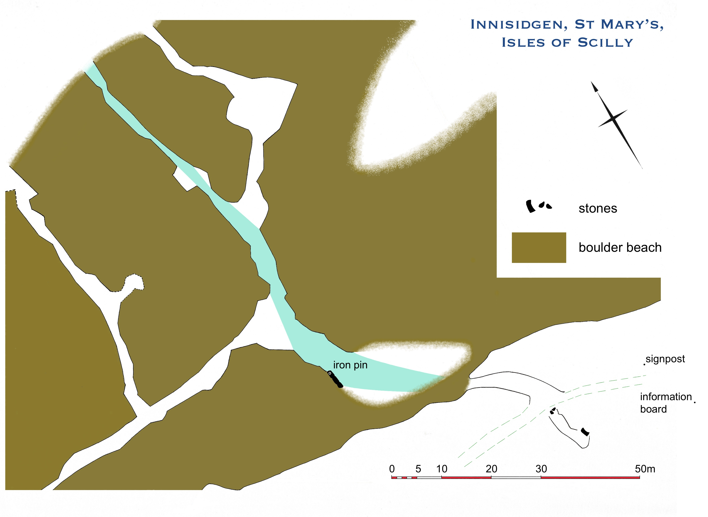
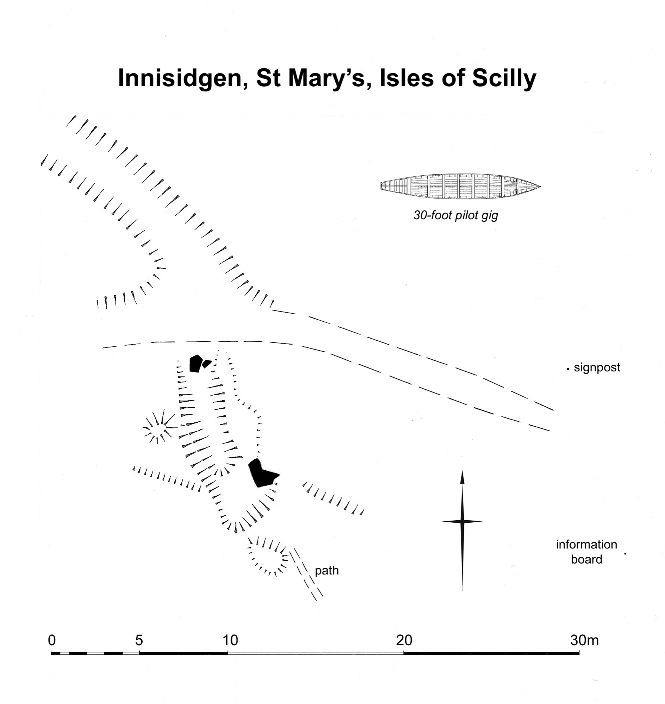
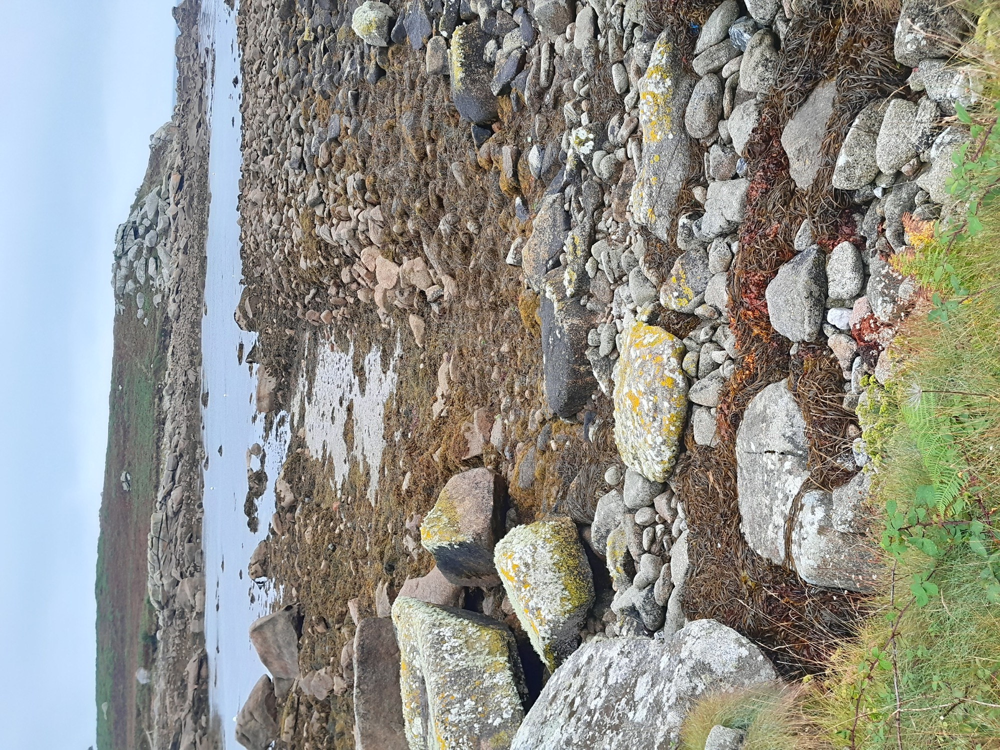

# Innisidgen, St Mary’s
## A lost early gig shed, and a kelp-harvesting site

Gigs have been used for around 400 years on Scilly. An East Indiaman, _Royal Oak_, struck on the Bishop and Clerk rocks in 1665 (Cummings 2016, 41-42). Ships’ timbers, and spices from the cargo, driven in on beaches, alerted Scillonians to the wreck. They ‘hastened boats’ there and rescued survivors, wounded and starving, from a rock, possibly the Daisy in the Western Rocks. 

Dr Joanna Mattingly has found an image of gigs from 4 centuries ago (**Photo 1**), on a map of church lands at St Just in Roseland, Cornwall. This is the parish where many island gigs were built by the Peters’ yard at Polvarth, St Mawes, 2 centuries later. The gigs depicted in 1620 have 7 or 8 oars (all shown, with artistic licence, on the same side of the boat).

_1: Depiction of an 8-oared gig on the creek by St Just in Roseland churchyard in 1620. Reproduced with kind permission of Kresen Kernow, Redruth: ref. ACS ARD/TER/637._

Gigs were later limited to 6 oars, to make it harder for them to evade pursuit by Customs cutters. Masters of gigs on Scilly petitioned against a restriction to only 4 oars in 1829. Fifty years later, in 1879, Peters built the _Czar_, originally fitted for 7 oars, for Bryher **LINK to _Czar_ shed page**.

Many pilot gig sheds are plotted on the large-scale OS maps of 1887-1888. The OS also plotted clearings running across rockier shores (except on Tresco, surrounded by sandy beaches apart from at its north end which has higher cliffs). These features are revealed at low tides, often strewn with shifting beach stones and festooned in seaweed.

Islanders preserve traditions of these inter-tidal ways (Richard Jenkins, pers comm). Kelp was carried up here to be dried and burnt in stone-lined pits. It produced a residue exported for use in industry from _c_1684 to the early 1800s. After kelping declined, its haulage ways were used to gather seaweed for manuring, appearing in early photos. Other linear ways provided passages for gigs, pointing directly to sites of gig sheds above them ─ some sheds mapped in 1887/1888, and some already too ruined to be mapped then, but still surviving as low earthworks today.

A network of ways on the shore at Innisidgen (**Photo 2**) was noted previously, by Jeanette Ratcliffe and Adam Sharpe formerly of CAU. As shown by the _Porths and Gigs_ plans, the route going straight to sea, second from the east in the network, is aligned with a slipway, and points to a ruined gig shed site above the slip (**Photos 3** and **4**) (within an existing Scheduled area). 

_2: Inter-tidal ways at Innisidgen. That seen on the left may be an earlier drang, running straight from a gig shed site to the sea. The branch to the right has an expanded ‘elbow’ shape. It may have served to land kelp (seaweed) and load it on pack animals, rather than for pilotage._

_3: Earthwork interpreted as a gig shed site at Innisidgen, with banks on the lines of its side walls and a hollow interior c.10m (32 feet) long Across the coast path, below, is the slipway, slanting down to the shore, following the same line as the long axis of the base of the shed._

_4: Plan of Innisidgen. The gig shed with its slipway, lower right, was served by an inter-tidal way 100m long (marked by the blue arrows), extended by branches for kelping to either side. (Modern signs to nearby prehistoric entrance graves, marked on the plan, can help to locate the shed site especially in summer, when bracken grows over the earthworks.)_

This is a sloping hollow, the size of a gig, with low banks where its walls stood, and fallen slabs likely to mark its doorway in front (**Photo 5**). This may be one of the earliest gig sheds still visible and undisturbed. It may have fallen in, rather than being dismantled, making its interior less regular in plan, seemingly well before 1887 as the OS did not see it. Innisidgen was a strategic site, on the east approach to Scilly and facing the off-islands.

_5: Larger-scale plan of Innsidgen gig shed and the top of its slipway. A narrow path upslope is the end of a route mapped in 1887, connecting the shed to the Helvear/Lenteverne area inland._

The network of ways on the shore here, which was mapped in 1887, can be seen to have been developed for kelping and later seaweed gathering, from the primary way aligned on the gig shed. Branches run along the shore as well as to sea, and there are enlarged clearings at mid-tide mark (**Photo 4**). As Mark Bowden suggests, the enlarged bays may have been used to hold kelp ready to be hauled up for drying and burning. If this network dates from the height of kelping, before c.1800, the gig shed with its slipway could be 18th century or earlier.

The terms used for the gig passages vary across Scilly, reflecting the varying heritage of the different islands. They include ‘lake’, on St Mary’s, ‘trackway’ on St Agnes, and ‘drang’ on Bryher (thanks to John Williams, Jof Hicks and Richard Jenkins for information). The _Porths and Gigs_ project uses the term drang as it is a local dialect word. Drang is also used in Scilly and Cornwall to mean natural channels between rock ridges on shores, and by extension to mean alleys in some fishing villages such as Mousehole.

Another site on St Mary’s, indicated by a drang, is on the south side of Porth Hellick. A hollow there (hard to reach on the overgrown steep coastal slope) is gig shed width, but is shorter, perhaps truncated by the sea (**Photo 6**). There may be more long-lost gig shed sites to find.

_6: Drang at Porth Hellick, seen from a hollow above it interpreted as a ruined gig shed. In the background, left, is a re-roofed gig shed to the north of the porth, with its own drang._

## Sources

Cummings, E, 2016. _A Compendium of Incidents Incurred by the Major Ships used by the English (later British) East India Company c.1600 to c.1834_ (Nautical Archaeology Society website)  

