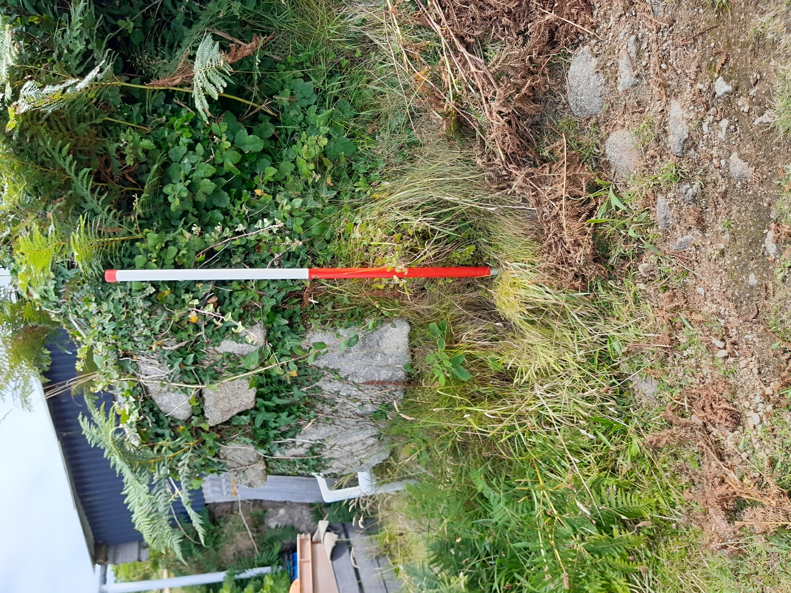
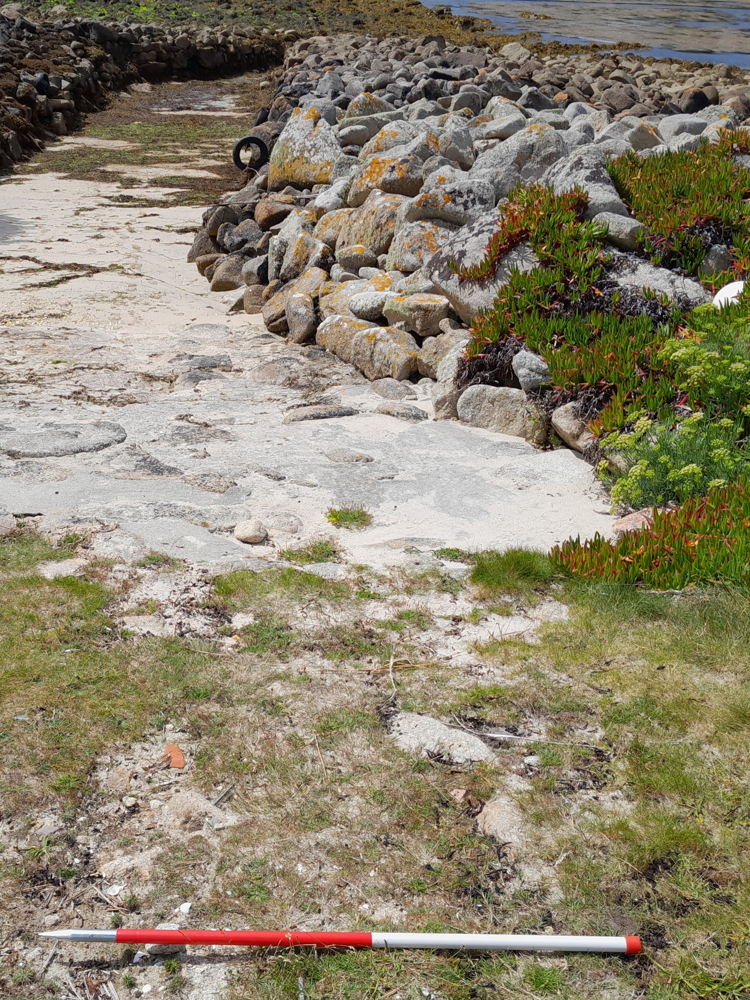

**Porths and Gigs of the Isles of Scilly: [Home](index.md) &#124; [The Project](project.md) &#124; [Around Hugh Town](around-hugh-town.md) &#124; [Innisidgen, St Mary's](innisidgen-st-marys.md) &#124; [New Quay, St Mary's](new-quay-st-marys.md) &#124; [Peraskin, Agnes](peraskin-st-agnes.md) &#124; [Great Par, Bryher](great-par-bryher.md) &#124; [Beacon Hill, Tresco](beacon-hill-tresco.md) &#124; [Signal Rock, St Martin's](signal-rock-st-martins.md)** 

# New Quay, St Mary’s
## ‘Boat-shaped’ sheds, and their monumental route to the sea

New Quay, facing the eastern approach to Scilly, has been used by gigs for some 300 years, or more, appearing on a relatively detailed early chart of the islands made in 1735. It has a well-preserved complex of half a dozen gig sheds, partly within a larger Scheduled Monument area. 

The sheds are early in style. Their stonework is barely coursed, and the walls bulge out in places (**Photo 1**). The long sides curve out near their centres, making the sheds slightly boat-shaped in plan. Sheds have imposing doorways. Bulky upright slabs form their openings, to either side, and these have slanting front faces that project forwards as they rise, with eye-catching effect.

_1: Plan of New Quay, with gig sheds clustered around the head of the slipway to the Lake._

In contrast, the small, high gable end windows, more irregular and made of smaller slabs, are meant to give ventilation and a bit of light, rather than to be seen (**Photos 2** and **3**). The floors are sloping, dug into the slope as necessary to fit the sheds into the coastal slope. A few sheds seem to have rough paving, and in some, the inner end walls incorporate outcropping bedrock.

_2: Imposing east side to the doorway of the gig shed furthest south east at New Quay, with one of the shorter but still original boat sheds beyond (fitted with modern sheet roof and doors)._

_3: Traditional gable end opening for some light and ventilation, south east gig shed, New Quay._

A monumental drang was made here, passing through a ‘brow’ of boulders (**Photo 4**). This was named the ‘Lake’ or ‘Creek’ (John Williams, pers. comm.). It is a remarkable 80m long. Gigs would seem to have been carried along it, not dragged, as the base is bedrock rather than sand (Fraser Hicks, pers. comm.). Original parts of its walling have an early character, like the gig sheds it served, with stones set vertically like those in Scilly’s oldest piers (**Photo 5**).

_4: New Quay’s ‘Lake’ or drang passing through the stones of the Brow, on a rising tide. On the horizon are Samson and Bryher (ahead) and Tresco (to the right)._

_5: North side of the long straight inner reach of the Lake. Beyond the tumbled stone facing in the foreground is original style facing with ‘pitched’ or vertical stones (near the hanging chain)._

As the gigs here could only work out of the Lake, their sheds were bunched closely around the slipway above it. A primary shed, aligned on the slip, formerly extended back beyond its present inner end which now contains a bench (**Photo 6**). More gig sheds were added, making 5 or even 6, plus a couple of smaller boatsheds. An access track from the east was left between sheds, just wide enough for the boat crews and pack animals (**Photo 6**).

_6: Gig sheds on the east at New Quay. The stone in the foreground, left, with rope tied on, marks the front end of the original gig shed levelled into the slope below (which formerly ran on behind the pallet bench inside it). Behind the right hand boat is the early path entering the site._

Like other drangs, the Lake can be strewn with rocks by stormy seas. Parts of its sides have been rebuilt as necessary in order to keep it open. The Williams family worked on a major restoration shown in an old photo (**Photo 7**). This view also captures the lost rope-thatch roofs and boarded fronts of the gig sheds, and the lines used for securing boats within the Lake.

_7: View of New Quay from the Lake, probably early 20th century, courtesy of Mr Williams. Repair of the sides of the gig passage, using a crane pole to lift stones, is under way._

Gigs kept here include _Elaine_ (John Williams, pers. comm.) and in earlier times the _Franklin_. _Elaine_, 5-oared, was built by Thomas of St Ives for Israel Hicks of St Agnes for Round Island lighthouse relief work. She was sold to Jack Thomas of St Mary’s, and ended smashed up in a gale at Porth Cressa in 1958. _Franklin_ was a New York paddle-steamer of 1848 (wrecked near her home port in 1854). She made a transatlantic crossing in 12 days and 10 hours. Could the gig have been named by the pilots in memory of this phenomenal ship, after they encountered her?

Later in the 20th century, parts of two gig sheds, and one of the smaller boatsheds, were re-roofed. A timber shed was added on the west, adapting the earlier site of a few small stores. The access track from the west was already wide enough for a cart when the 1887 OS map was made, and like the slipway it has some old rough paving visible (**Photos 8a & 8b**).

_8a: Rough paving on the track to New Quay from the west, passing the central gig shed’s corner_

_8b: Rough paving on the slipway which is now partly renewed with concrete and partly grassy_

Continued use for boats on a small scale has helped to maintain the site and preserve the memory of its traditions. One local story tells that the Lake was once defended using pitchforks against people trying to land (John Williams, pers. comm.) Given the age of the site, and its location on the edge of Scilly away from its town and garrison, this could well be a memory of a raiding episode, perhaps during a period of wartime several centuries ago.

The _Porths and Gigs_ fieldwork here was carried out courtesy of landowners the Duchy of Cornwall, and with assistance from present-day users of the site.

## 3D models

**New Quay’s ‘Lake’**, cutting through a ‘brow’ of coastal boulders. The name Lake appears on a 1792 map for another gig trackway, at Perconger (Porth Conger) on St Agnes ─ later adopted to serve the coastguard station now the _Turk’s Head_ pub.

This Lidar (light detection) model, like the site plan, was made at extreme low tide to capture the full extent of the tidal remains. It shows how the Lake slants west through the brow before turning out, so breakers could not sweep straight up it; giving it a J-shaped plan. The base of bedrock, with the paved slipway above, helped crews carry gigs to and from lower seas even by night.

Pilots also put out from sandy beaches ─ like nearby Pelistry (_Porth Lister_ or ‘Boat Porth’ in Cornish) where the Morris, Tregear and Williams families kept a shared gig. Tidal ways allowed use of strategic sites otherwise bound by rocks. They even offered greater protection against raiding from the sea, in the early days of pilotage, as their use was dependant on local knowledge.

[View the 3D model on Sketchfab](https://sketchfab.com/3d-models/new-quay-st-marys-isles-of-scilly-lidar-57fa9fc6472f4d248c05316fc9034595).

**New Quay setting**. This ‘NeRF’ model (combining geometry, texture and lighting data, in a sort of inter-active 3D impressionist painting!) helps reveal the landscape of the site.

To the west on St Mary’s, in front of Helvear Hill with its later pine trees, is Tregear Porth with its smaller drang. The little carn on the skyline past Helvear (with a prehistoric entrance grave) marks Innisidgen ─ another location explored in this website.

The northern off-islands appear in a great arc on the horizon. The former frequency of gigs on this coast reflects its value for communications between islands, as well as pilotage. Scilly’s chaplain, John Troutbeck, noted in 1796 (for Pendrathen, beyond Innisidgen) how it served ‘for the off island people to land at, and others, who may have business on the East part of St Mary’s Island, as well as for the inhabitants of the West part of St Mary’s Island, when they pilot out vessels, or have business at the off-islands, and cannot get home, by means of a contrary wind.’

[View the interactive photo (NeRF) on Luma AI](https://lumalabs.ai/capture/ecc02153-8476-4590-b68e-a35f6cf5ab80). Click or tap to stop the animation and drag and pinch to explore it.

**New Quay’s south-eastern gig shed**; model of the insides of the walls (partly built into the slope behind and part covered by ivy and boats in the interior).

The slight bulging of the shed made more space to load or maintain a gig, while limiting the roof span needed. A few bits of red tile, as well as stone, are found in the walls as trigs (small pieces filling gaps between the main stones). This may suggest that Bridgwater tile was used for some roofing or repair nearby. This shed, though, was thatched when photographed in the early 20th century.

Roofing with salvaged timber and rope thatch was traditional, for sheds as for island houses. Nets of rope holding the thatch were fixed to pegs in wall tops. Peg holes, even actual pegs made of bone, remain in places. They could survive here under ivy, as the walls stand to full height or near it.

Drill holes are visible in the massive front slabs. The double doors were hinged on iron hangers in such holes, or pivoted in sockets cut in slabs laid in the floor.

[View the 3D model on Sketchfab](https://sketchfab.com/3d-models/new-quay-gig-shed-349b2e9b5ba64960bb9503f952804d99).

## Sources

Jenkins, AJ, 1975. _Gigs and Cutters of the Isles of Scilly_. Integrated Packing Group Ltd. and the Isles of Scilly Racing Committee

Quixley, RCE, and Quixley, JME, 2018. _Antique Maps of Cornwall and the Isles of Scilly_. 2nd edition. RCE Quixley: Penzance

Smith, EW. _Trans-Atlantic Passenger Ships Past and Present_. George H Dean Co.: Massachusetts

**Porths and Gigs of the Isles of Scilly: [Home](index.md) &#124; [The Project](project.md) &#124; [Around Hugh Town](around-hugh-town.md) &#124; [Innisidgen, St Mary's](innisidgen-st-marys.md) &#124; [New Quay, St Mary's](new-quay-st-marys.md) &#124; [Peraskin, Agnes](peraskin-st-agnes.md) &#124; [Great Par, Bryher](great-par-bryher.md) &#124; [Beacon Hill, Tresco](beacon-hill-tresco.md) &#124; [Signal Rock, St Martin's](signal-rock-st-martins.md)** 
