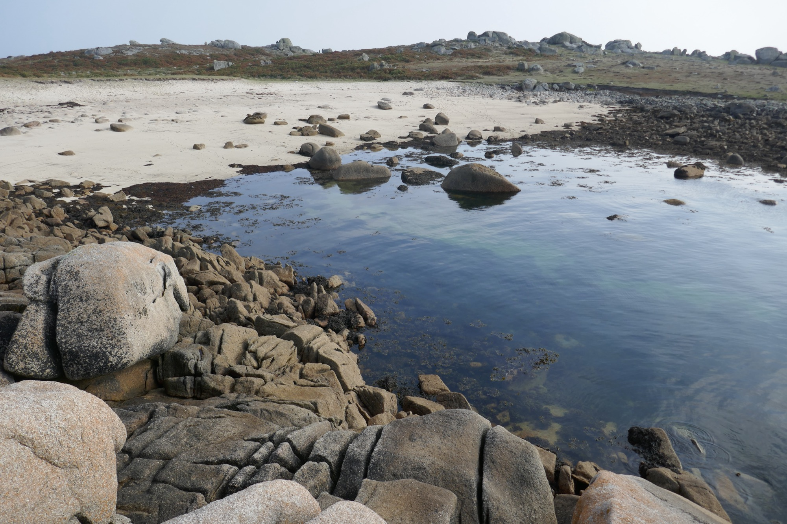
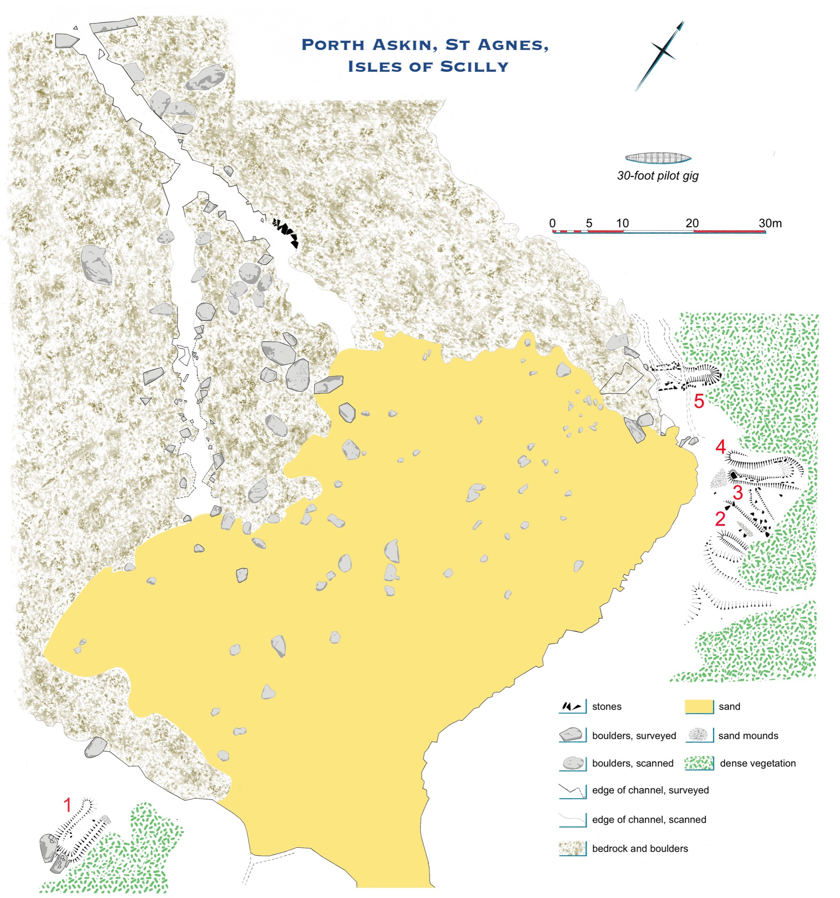
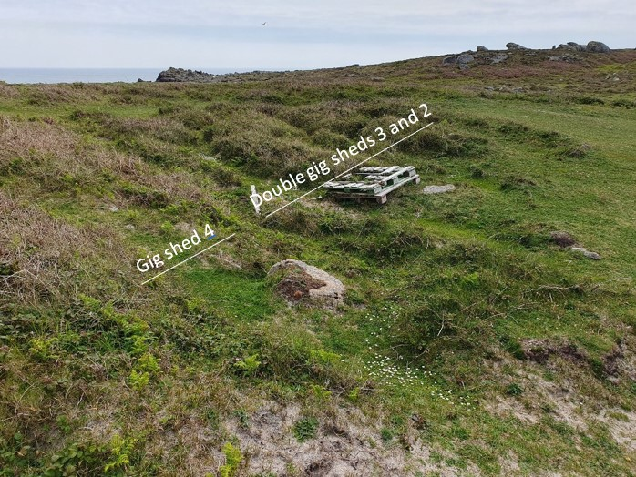
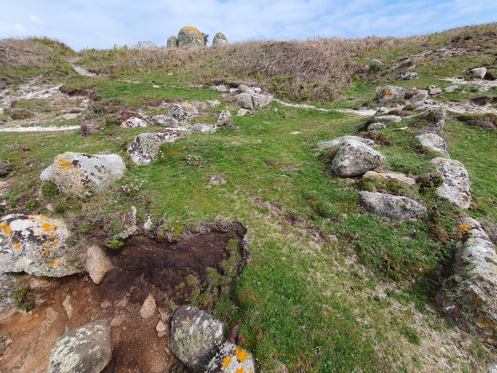
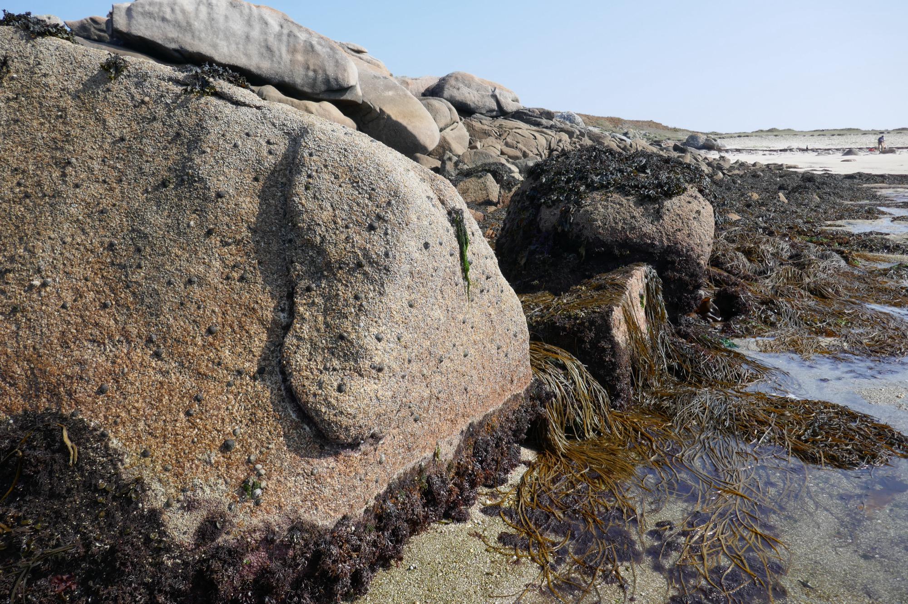
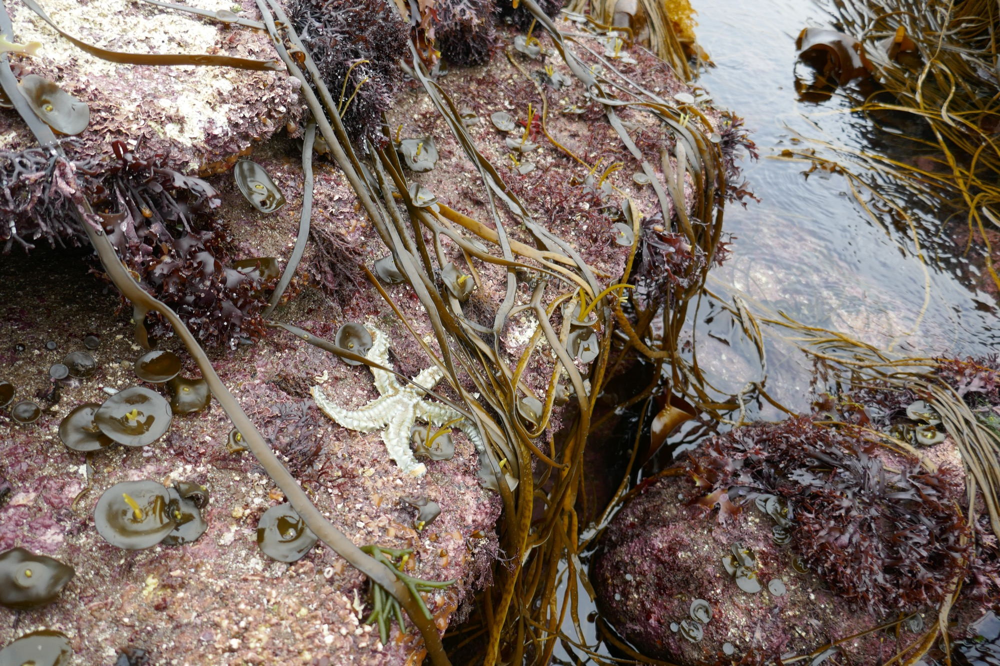
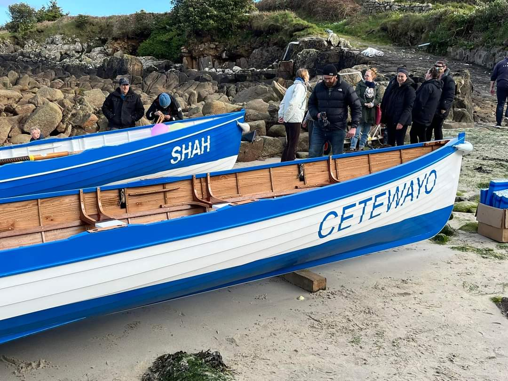
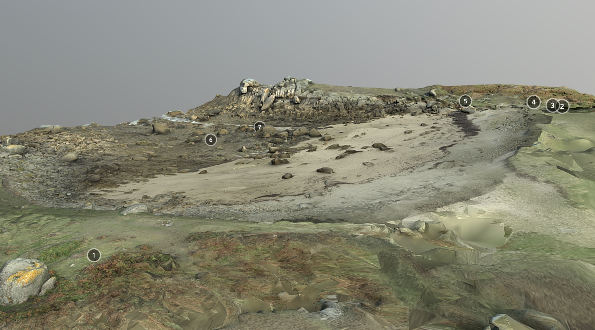
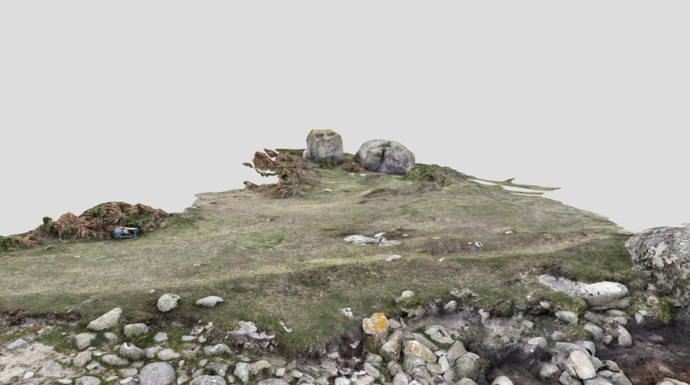
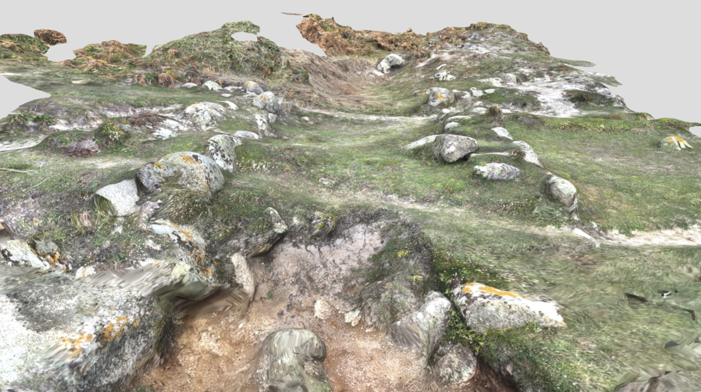

**Porths and Gigs of the Isles of Scilly: [Home](index.md) &#124; [The Project](project.md) &#124; [Around Hugh Town](around-hugh-town.md) &#124; [Innisidgen, St Mary's](innisidgen-st-marys.md) &#124; [New Quay, St Mary's](new-quay-st-marys.md) &#124; [Peraskin, Agnes](peraskin-st-agnes.md) &#124; [Great Par, Bryher](great-par-bryher.md) &#124; [Beacon Hill, Tresco](beacon-hill-tresco.md) &#124; [Signal Rock, St Martin's](signal-rock-st-martins.md)** 

# Peraskin (Porth Askin), St Agnes
## A whole base for pilotage on an outlying porth

This cove (pronounced ‘Per*askin*’) lies on Wingletang Down, at the wild south-western tip of the inhabited islands of Scilly (**Photo 1**). Its Cornish place-name may mean ‘porth of the sedge grass’ (Oliver Padel, pers. comm.). It is eroded by the massive seas from the west, but undisturbed, the main modern change being growth of low scrub.

_1: Peraskin on a rising tide, with the huge boulders on the shore still protruding._

The project has created a plan (**Photo 2**), and a 3D model, of the whole porth here, with the help of the islands’ Community Archaeology Group in reducing bracken and bramble cover, and with the assistance of volunteer surveyor Teän Roberts of Scilly. 

_2: Plan of Peraskin (Porth Askin as labelled on OS maps) with gig sheds numbered in red._

An outstanding complex of archaeological remains, still visible on the surface, shows that the par (the Scillonian word) or porth was used as a base for gigs, potentially all through the great era of pilotage from the 17th to the early 20th centuries. There are ruins of five gig sheds, placed here for proximity to the hazardous Western Approaches. (As old maps show, around 1800, as today, the nearest hamlet was Higher Town, half a mile away across the open down.)

The shed walls show on the ground as earthworks, that is, as banks of sand and turf, some with stonework still visible (**Photos 3**-**5**). There may once have been even more sheds. The shore has become eroded back, and shrouded in small sandhills, especially on the south east.

_3: Earthworks of the early gig shed no. 1 at Peraskin, seen from the rocks behind it (1m scale)._

_4: Looking south across Peraskin’s central gig sheds, nos. 2-4. Beyond the site, the sea to the east of St Agnes appears across the ridge of Wingletang Down; conveying the strategic value of the siting of the sheds on this headland, the southernmost point of St Agnes and of Scilly._

_5: Peraskin’s northern gig shed, no. 5, associated with the late-19th century gig _Cetewayo_. The seaward end of the shed, in the foreground, is being cut back by coastal erosion._

Three sheds, a single one and a pair, are Scheduled Monuments, meaning they are protected by law as well as by the community ─ some of the islanders are direct descendants of the pilots. Despite this, the monuments are threatened by coastal erosion and sea level rise, gradually advancing.

The plan and models help uncover details of the site, while it still survives, evoking what it was like to work gigs here. Trackways through seaweedy stones emerge on ebb tides, revealing the routes the crews took to carry gigs at low water, walking on the bed of the sea (**Photos 6**-**8**).

_6: Peraskin on an ebb tide, with the beds of its drangs or gig trackways emerging. Their junction (centre photo) lies a couple of boats’ lengths in from the open sea._

_7: Alignment of rocks placed between natural outcrops, retaining the spread of the boulder beach, on the north side of the gig trackways or drangs at Peraskin._

_8: Archaeology and marine ecology meet at the mouth of Peraskin’s gig trackways or drangs, only uncovered at exceptionally low tides._

Peraskin was used to house the _Cetewayo_, the fastest gig on Scilly in her heyday around the time of Queen Victoria’s Golden Jubilee of 1887_._ She was built by Peters of St Mawes to work in St Ives, but was subsequently bought by St Agnes pilots and kept here until broken up after winning a regatta in the early 20th century, as Alfred Jenkins records.

The name of the old _Cetewayo_, also given to St Agnes’ latest gig, built by Patrick Bird (**Photo 9**), is that of a Zulu King, celebrated in Britain in 1882. Cetewayo, or Cetshwayo kaMpande, was King from 1872 of Zululand in present-day South Africa. In 1879, 24,000 Zulu warriors routed British forces but were soon defeated, and Cetewayo was held captive in Cape Town, in a conflict widely seen as unjustly pursued by Britain.

_9: Launch in 2024 at Perconger, St Agnes, of the island’s new gig _Cetewayo_, built by Patrick Bird (with acknowledgements for the photo by Julian Pearce on St Agnes Gig Club Facebook page)._

In 1882, however, King Cetewayo was permitted to visit London for several weeks. On August 4th he landed at Southampton and travelled by train to reside at 18 Melbury Road, Kensington, now marked by one of English Heritage’s Blue Plaques. The King was hugely popular, and gained the respect and support of several leading British statesmen (**Photo 10**). Crowds followed and cheered him as he negotiated his reinstatement. He returned to Zululand in 1883, but further turmoil there, and possibly treachery, led to his death in 1884 after which his young heir Dinizulu was proclaimed king. (Information from the Blue Plaques website.)

_10: King Cetewayo, wearing his traditional _isicoco_, a head-ring worn by Zulu men, in London in 1882. (© National Portrait Gallery, London. Thanks to the Gallery and to the English Heritage Blue Plaques scheme website for the photo and for caption content.)_

Cornish newspapers reported that Cetewayo arrived from Cape Town on the _Arab_, a 350 foot steamer. On August 3rd before reaching Southampton, _Arab_ touched at Plymouth early in the morning, after a rough run from Madeira and through the Channel in a severe gale. People crowded to Plymouth to see the powerful figure of Cetewayo, who sat on deck with his chiefs. He wore, at that time, a pilot coat (_West Briton and Cornwall Advertiser_, August 10 1882, 3; _Cornubian and Redruth Times_ August 11 1882, 4). On his departure, the King left from Plymouth, again in a gale, on the _Nubian (op cit,_ September 8 1882, 6), a steamer very like the _Arab_.

Possibly the Agnes gig was named for Cetewayo after her crew provided pilotage to the King’s steamer, or one of their number encountered the scene in Plymouth after serving another ship. 

Islanders will have known Cetewayo by reputation also. Admiral Sir Housten Stewart, Commander-in-Chief of Devonport, took the King in his yacht _Vivid_ to see a gunnery ship and factory before he left Plymouth (_ibid_). The following month the Admiral promoted to flag-lieutenant A.H. Smith Dorrien, of the Tresco family, specifically for his services in the Zulu War (_Cornishman_, October 19 1882, 5).

## 3D Models

### Porth Askin / Peraskin

[View an interactive model of Porth Askin / Peraskin on Sketchfab](https://sketchfab.com/3d-models/porth-askin-st-agnes-isles-of-scilly-50ad2cc6bba846d097c150b52eb3fa9f). Click the numbered annotations to learn more. The text from these annotations is included below.

**Annotations**

**(1)** Early gig shed on the south. This shed is a turfy ruin, built against natural rocks as shown in a separate model. It was made, used, and reduced to slight banks, all before 1888, when it went unseen by surveyors making the detailed OS map.

It could be that use of a shed ceased, out of distress and respect, after loss of a gig’s crew at sea. In 1822 Woodley noted such a disaster had occurred ‘some years before’. Two men of St Agnes, part of a crew rescuing survivors from a wreck on Scilly Rock, were drowned when the gig overturned. Some sheds may have fallen out of use when pilotage was controlled by licensing (of pilots rather than gigs) from 1810.

In 2019 this shed was found and planned by visiting archaeologists Tom and Elisabeth Greeves. The _Porths and Gigs_ survey, made at extra low tide, shows how it relates to the southern gig trackway (number 6 on the model). The OS surveyors did find and plot this trackway, in 1888, indirectly adding to the evidence of an early date for the shed used with it.

  

**(2)** Later sheds clustered at the north east corner of the porth. Sheds 2 and 3 formed a pair, aligned on another gig trackway at number (7). This double shed is now a Scheduled Monument. In 1888 it had no roof, but its long walls were near-intact, as shown by the map of that date.

These sheds, facing west into prevailing winds, have linear banks of sand blown through them, as well as others accumulated along the side walls. Another bank runs roughly parallel outside Shed 2, on the south. This may mark the end of an old route to Peraskin across Wingletang Down, worn down by pack animals or carts brought here to carry freight or salvage brought in by the gigs.

There are no clear signs on the ground of inner end walls to the double shed. They could again be shrouded in sand. However, the OS found none back in 1888. Possibly these sheds had doors at each end, so their gigs could be carried across the 100m ‘neck’ of the headland behind to launch to the east at Beady Pool if conditions were better there.

  

**(3)** This shed is Scheduled together with Shed 2 alongside. Both have accumulated blown sand since the roof was lost before 1888. Here, there are also some displaced stones, perhaps once intended for re-use.

Some double sheds started single, as at Little Cove Vean, St Agnes (where the second one is shorter). Others appear built as a pair, like those mapped as one block in 1887 at Town Beach, St Mary’s (where Golden Bay Mansions now stands; Alfred Trenear, pers. comm.)

Possibly original pairs were built for organisations like Lloyd’s who kept their _Lloyds White_ and _Lloyds Green_ gigs at Town Beach. Other sheds may have been doubled, when pilots bought a second gig.

A St Agnes gig _Wasp_ appears at Peraskin on an old painting (Patrick Bird, pers. comm.). The _Bee_ was apparently based on St Agnes by 1841 when she went out to the wreck of the _Thames_. (See ‘Archaeology of the building of pilot gigs’ page for remains attributed to the _Bee_ herself.) Could these two gigs, with their related names, have been housed here?

  

**(4)** This shed was built after the pair on its south. The front of its south wall protrudes slightly across that of the north wall of Shed (3). It stayed in use later too, being shown as roofed and labelled Boat House on the 1888 map. However, it was just a shell when that map was revised in 1906.

The shed was re-discovered by Teän Roberts during the _Porth and Gigs_ survey. It has low banks where its walls were, with some stones still in place. Like many old sheds its base has a regular slant, which helps identify its extent. Sloping floors meant steeper or rockier sites could be used with minimal groundworks, and may have helped to speed launching.

Richard Gillis of Newquay recorded some of the lore of gig launching at speed including at night. Rivalry for pilotage at Falmouth and St Mawes, he was told, led to a crew going to launch without boots to avoid alerting others. On Scilly, he says, oars were marked with notches, so their rowing position numbers could be identified more easily in the dark.

  

**(5)** Northern gig shed. This shed is Scheduled, like double shed (2) and (3). Parallel with Shed (4), it may be of a similar date, _c_1880 if newly built for the historic gig it’s linked to (below). Also like (4) it still had a roof when the 1888 map was made. However, it was soon reduced and the 1906 map showed nothing here.

This shed is identified locally as having housed the old gig _Cetewayo_ (Patrick Bird and Tristan Hick, pers. comm.) The main Peraskin page gives stories of this gig, famed for her speed, and of her namesake, the Zulu King famous in Britain around 1882. A separate 3D model presents the structural remains here, clearer than those of the sheds to the south.

Possibly _Cetewayo_ was moved around 1900 to Shed (2), as that shed appears from the map evidence to have been kept up later. Gigs are known to have been moved in the past between sheds, in the same porth or at another, on occasion, following storm damage or other changes; as well as being sometimes sold on to another island’s pilots.

  

**(6)** South drang or trackway. This way is fairly choked with stones and boulders, and cloaked by seaweed growing on the stones. It may have ceased to be maintained relatively early; shed (1) which it served fell out of use well before 1888.

The sea has displaced its revetments, or covered them in loose stones. Its approximate span can be seen though, as the layer of stones filling it is less thick than the natural boulder bed alongside.

The junction of this trackway and the one that served the northern sheds (7) is intriguing. As this way kinks at the junction, it might have been joined on to (7), making it later in date. This would imply that one or more of the northern sheds, aligned with (7), were earlier in origin too.

However, the makers of the ways had to route them to avoid the larger inter-tidal natural rocks that are a feature of Peraskin. It may be that the seemingly primary north trackway was actually joined on to this southern one which kinked to get around rock too massive to move.

  

**(7)** North drang or trackway. This is among the clearest of Scilly’s drangs, probably because it was kept open well into the 1900s for the use of the old _Cetewayo_.

Some of its facing stones, set up by the pilots between the larger natural boulders to hold back the beach rocks, can be seen standing _in situ_. Others may be still in place under shifted stone and thick seaweed. This facing is marked in black on the site plan, like that visible in places in the gig shed walls especially at shed (5). The more massive, rounded boulders, protruding even at higher tides, determined the positioning of the trackways and so of the gig sheds.

At extreme spring tides, as when the _Porths and Gigs_ fieldwork took place, the full extent of the trackway is revealed; together with the prolific seaweed and marine life harbouring in it that help make this area a Site of Special Scientific Interest. As elsewhere on Scilly, with the passage of time many archaeological sites become rich in ecology as well as historical meaning.

### Peraskin Gig Shed (1)

[View this 3D model on Sketchfab](https://sketchfab.com/3d-models/gig-shed-1-porth-askin-st-agnes-scilly-0b05bd611a3a4409a2a7ff3ad15a72c4).
  
This long-lost shed, gone before 1888, was built against two natural rocks rising to head height. These boulders have solution basins worn in their tops by centuries of weathering. 

Wingletang Down, above Peraskin, is one of Scilly’s most dramatic ‘rockscapes’. It has hundreds of outcrops and carns with spectacular shapes and basins. There are dozens of Scheduled Monuments, including Early Bronze Age entrance graves and cairns sited like the gig sheds partly in response to the natural rocks.

The two boulders here have fairly vertical sides, used to form the shed’s inner end with masonry filling the gap between them. Many old structures on Scilly, from barns to fortifications, incorporate outcropping rocks where these stood convenient for use.

The banks where the side walls stood run half way to the present head of the beach. The earthwork appears to be a typical ruined gig shed ─ just large enough for a gig at 10 paces long and (allowing for wall tumble) 3 paces wide inside.
  
### Peraskin Gig Shed (5)

[View this 3D model on Sketchfab](https://sketchfab.com/3d-models/gig-shed-5-porth-askin-st-agnes-scilly-420d7b70cb884f8b91b20c3d79f27365).

This shed, attributed to _Cetewayo_, is also a Scheduled Monument. It is listed by Historic England as being ‘At Risk’. Its front end has been destroyed by the sea. It has also been worn down by several strands of the coast path, which run across it.

Due to the erosion, the walls are more exposed towards the front, They are narrow and regular compared to those of early sheds like New Quay’s. Their width is more standard, _c_0.9m, and they were built up in courses. The wall cores are the traditional subsoil, or ram, however.

There is no trace of a slip, yet the site is several metres above the beach. Perhaps timber ‘ways’, were laid here. Ways are known to have been used at the shed of the _Golden Eagle_ of similar date (1870) at Great Porth, Bryher, restored as a studio (thanks to Richard Pearce for information).

This monument, with its clear walling and its gig passageway below (7), gives a strong sense of how the old _Cetewayo_ was housed and worked by the pilots, just six generations ago.

**Porths and Gigs of the Isles of Scilly: [Home](index.md) &#124; [The Project](project.md) &#124; [Around Hugh Town](around-hugh-town.md) &#124; [Innisidgen, St Mary's](innisidgen-st-marys.md) &#124; [New Quay, St Mary's](new-quay-st-marys.md) &#124; [Peraskin, Agnes](peraskin-st-agnes.md) &#124; [Great Par, Bryher](great-par-bryher.md) &#124; [Beacon Hill, Tresco](beacon-hill-tresco.md) &#124; [Signal Rock, St Martin's](signal-rock-st-martins.md)** 
