# Porths and Gigs of the Isles of Scilly

Welcome to this exploration of the archaeology of pilot gigs on Scilly, with results of fieldwork on all the main islands in 2024 (photo 1), including 3D models and plans made at extra-low tide. 

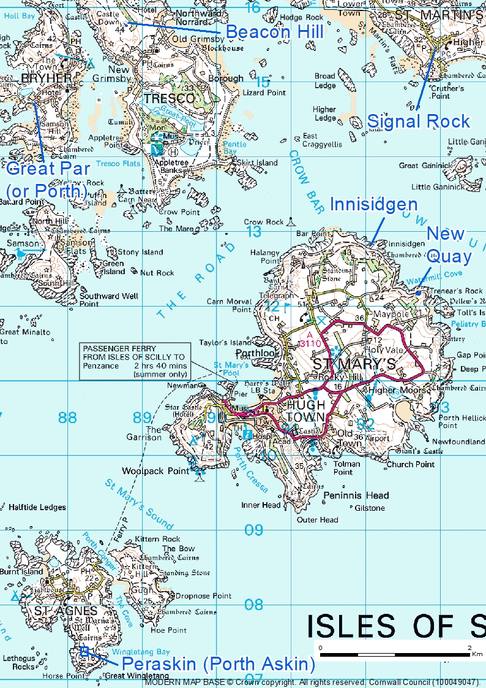

*1: Map of Scilly, with locations of main sites surveyed and scanned in the Porths and Gigs project.*

The Porths and Gigs work was led by Cornwall Archaeological Unit (CAU), and was greatly helped by groups and individuals on the islands and beyond. It is a ‘Monument Management Scheme’ project for Historic England and other partners (see Acknowledgements). The project aims to add to recording and appreciation of Scheduled Monuments and other archaeology of the gigs, in particular, including sites on shores subject to coastal erosion and sea-level rise.

On Scilly, the seagoing rowing gig boats, 32 feet long, built of fine planks of elm for strength and lightness, gained an outstanding local importance, and supported the maritime traffic of the UK. Gigs took pilots to ships on the hazardous approaches, saved lives and goods from wrecks, and served for work from harvesting kelp to building lighthouses (photos 2 & 3).

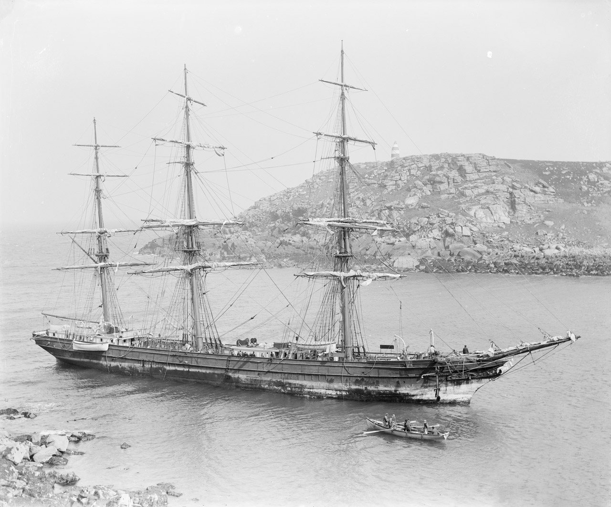

*2: A gig attends the Horsa after she struck in a gale in 1893 at Bread-and-Cheese Cove, St Martin’s. Photograph by Gibson **© National Maritime Museum, Greenwich, London.**
The Daymark, seen above the ship, was built in the 1680s, with St Agnes’ lighthouse, to mark the approaches to Scilly from east and west. Both structures are the earliest of their kind to survive in the UK, evoking the natural hazards of the islands that made the services of the pilot gig crews vital to navigation in the past.*

*3: Rare close-up view of a gig at the wreck of steamer King Cadwallon on the Hard Lewis rocks off St Martin’s in 1906. Photograph by Gibson, **© National Maritime Museum, Greenwich, London***

Gig rowing declined with the end of traditional pilotage, but was revived as a sport with clubs on Scilly, in Cornwall, and now many in England too. Hundreds of crews compete in the annual world championships on Scilly. Some of the islands’ old gigs are restored and are racing still (photo 4).

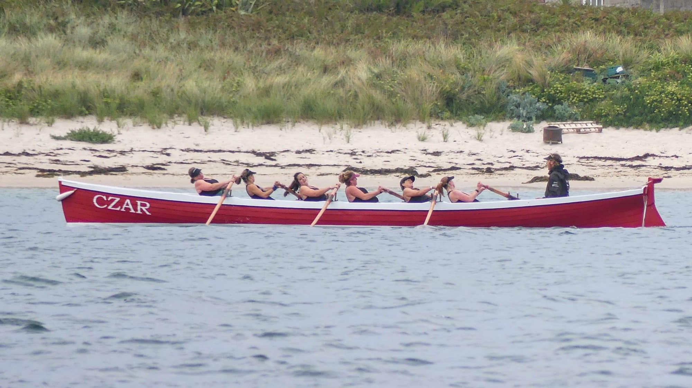

*4: The 1879 gig Czar pulled by a Tresco & Bryher Gig Rowing Club womens’ crew, winners of Scilly’s domestic racing season in 2023 and 2024 (thanks to Aaron Haile and Jonathan Taylor).
Czar’s original shed, on Great Porth, Bryher, is one of the sites surveyed and scanned as part of the Porths and Gigs project, producing plans and virtual 3D models on this website.*

Each of Scilly’s five main islands has traces of old gig sheds, the earliest potentially 17th century, some newly re-discovered. This archaeology reflects the organisation of pilotage, and relates to astonishing feats of rowing, including in horrific gale conditions, that saved ships, and lives. 

Clues from historic maps, ruins, and local knowledge, point to as many as 90 individual gig sheds (at 60 sites, some being in clusters). Archaeological remains of half of these sheds still survive. Six of the 60 sites (or parts of them) are Scheduled Monuments. A report **freely available here [link]** presents both the findings on this website, and other gig archaeology around the islands.

## Gig shed archaeology

The old sheds like the gigs were largely disused by the 1950s. Some have been restored (Photos 5 and 6). Many became buried in sand, or lost to the sea. Islanders passed on knowledge, crucial especially as the early gigs were not registered as such. Archaeologists recorded some remains, and several sites became Scheduled Monuments. But with accelerated coastal erosion and sea-level rise, due to climate change, the sites on the shorelines are increasingly at risk.

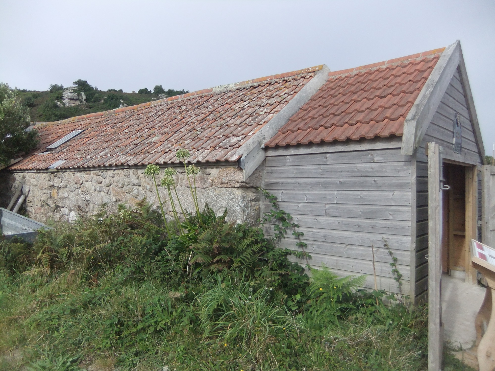

*5: Shed that formerly housed the Sussex, near the Bar on Bryher, restored to house a racing gig with an extension used for a display on gig heritage. Red roof tiles, from Bridgwater in Somerset, were used from the later 18th century for traditional buildings on Scilly as an alternative to thatch.*

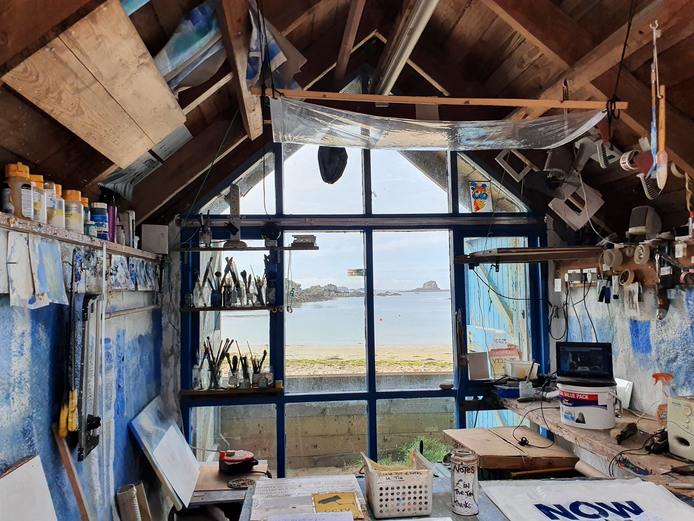

*6: Shed of the Golden Eagle of 1870 at Great Porth, Bryher, restored as a studio. Gigs could be sold between islands, and the Bonnet of 1830 originally based at St Martin’s was later kept in the roof beams here above the Eagle (artist Richard Pearce, pers. comm).*

To help share this heritage, before more is lost to the sea, the project team, with volunteers from Scilly and Cornwall, have made scaled plans (Photos 7 and 8) and interactive virtual 3D models (Photo 9). 

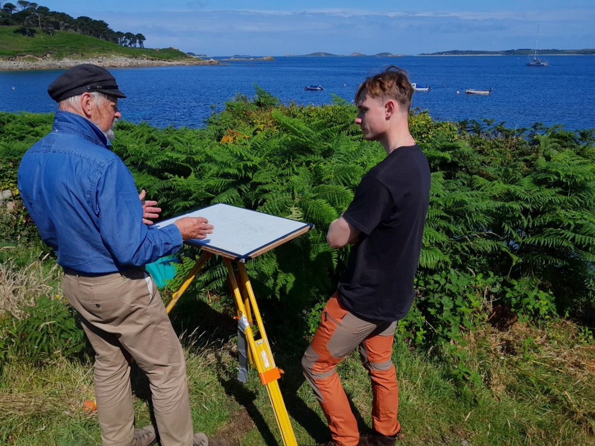

*7: Mark Bowden (left), leading specialist in archaeological survey (and great-great-great nephew of a Cornishman tried and acquitted for firing on an exciseman who was pursuing smugglers!) prepares a ‘plane table’ to plan the sheds at New Quay, St Mary’s, with volunteer Ben Sumpter.*

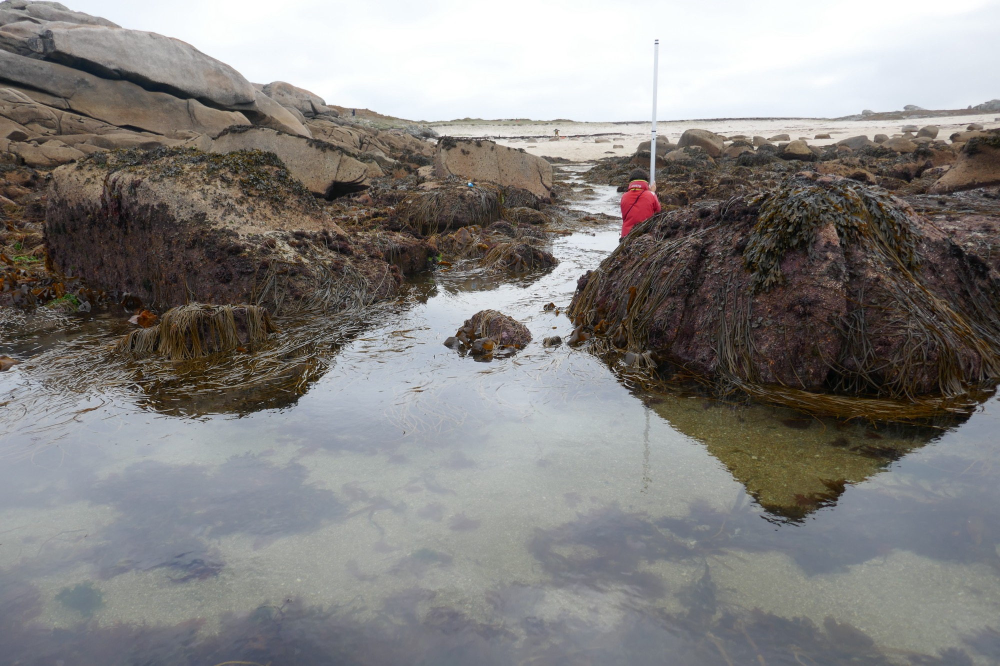

*8: Survey under way at Peraksin, St Agnes. Scillonian volunteer trainee Teän Roberts, holding the staff, is at the mouth of the tidal gig trackways. Mark Bowden (in the background) is at the plane table, sighting to the staff with the distance-measuring alidade to construct the hand-drawn plan. A pilot crew returning to this point at low tide, perhaps after rowing far out to the west, will have had to carry their gig from here to sheds on the edge of the turf beyond Mark’s station.*

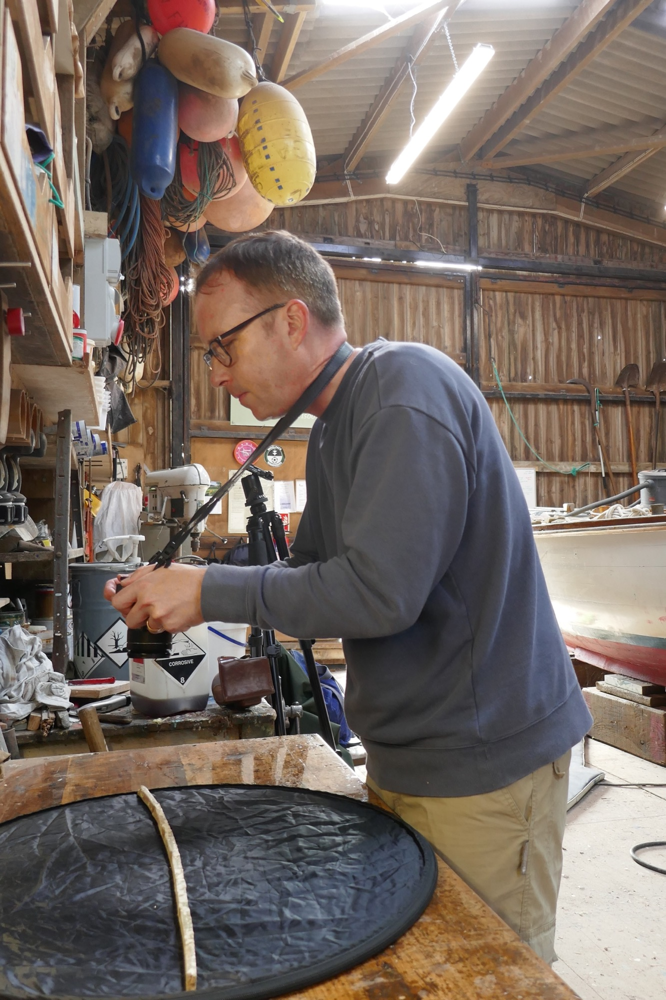

*9: Archaeologist Tom Goskar photographs a rib of the Bonnet at Porthloo Boatyard, St Mary’s, to create one of the 3D models, thanks to boatbuilder Andrew Hicks.*

We have combined the results with evidence from old maps, previous archaeological work, and local knowledge kindly contributed by islanders (Photos 10 and 11).
The project focuses on sheds and lookouts around the islands that help, in different ways, to reveal how gigs were housed to advance pilotage work ─ vital to merchant and naval shipping in the era of sail and steam, when hundreds of vessels could congregate in the islands’ sea roads.

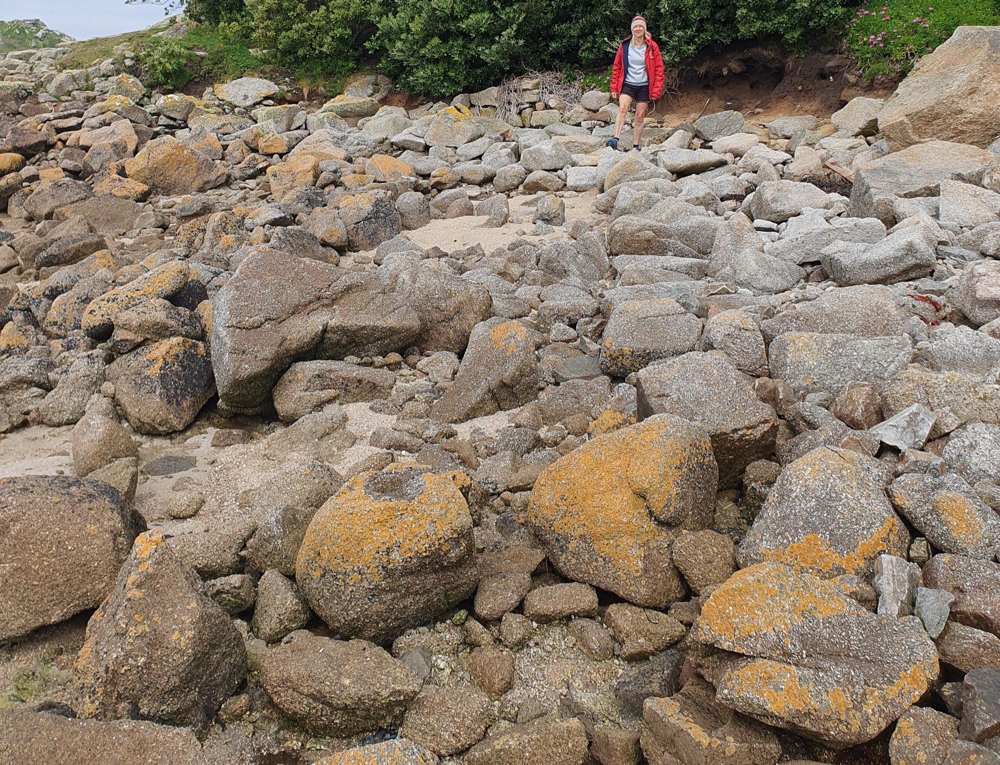

*10: CAU landscape archaeologist Cathy Parkes, project lead (also a gig rower) at the site of a gig shed, scoured out by the sea, below the hotel at Lower Town, St Martin’s. The long side walls extend back from the foreground on either side. The site was found 40 years ago by Cornish archaeologist Michael Tangye, pioneering recorder of coastal remains on Scilly.*

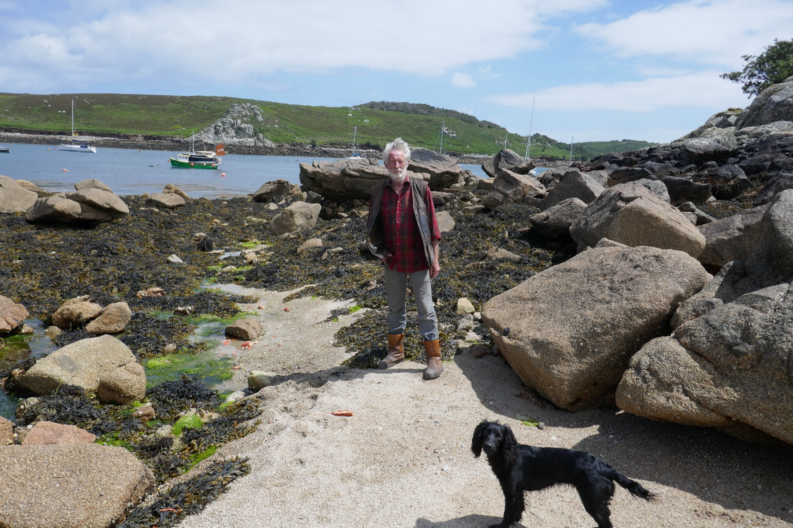

*11: Richard Jenkins of Bryher at Rapid’s Drang, at Kitchen Porth, one of the ways made and used by his family and others for gigs or punts to pass through inter-tidal rocks. This drang served the Rapid, one of the pilot cutters that worked with gigs (information thanks to Mr Jenkins). Rapid carried to St Mary’s two men saved from the fatal wreck of the Delaware by the crew of the gig Albion in 1871 (see the Czar shed page). One of the rocks seen here on the right (south) side of the drang has a wedge splitting mark in its base, indicating it was worked before 1800.*

The models and surveys capture how the sheds were built and deployed. Sheds could be put up quite readily by the joint owners of gigs. Walls were of stone, sourced nearby or re-used, with cores of ram (subsoil). Timbers were salvaged from wreckage, and roofs were thatched (Photo 12). Slipways of stone slabs were laid if needed. Even rocky outer porths (or pars, the word used on Scilly) could be made to serve, leaving monumental ways cleared through tidal boulders.

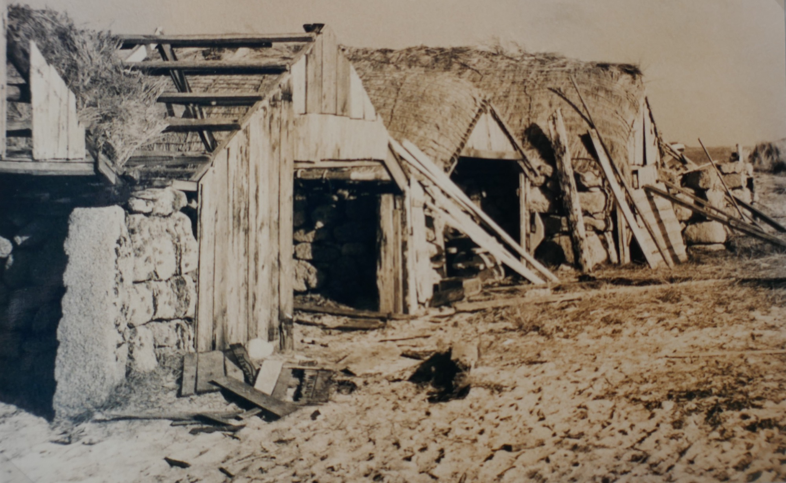

*12: Gig sheds on Lower Town Par, St Martin’s in a photograph of 1930 preserved on St Martin’s. Reproduced thanks to Michael Tangye, who copied it there 50 years later courtesy of Mrs P. Howell. Features include the large-mesh rope nets made to help secure the thatch roofs, and splitting marks on the left doorpost (potentially of c1800, although the stone could be re-used).*

## Porths and Gigs images and 3D models

The fieldwork took in sites on each of the five main islands.

* Around Hugh Town, St Mary’s ─ Archaeology of the building of pilot gigs
* Innisidgen, St Mary’s ─ A lost early gig shed, and a kelp-harvesting site
* New Quay, St Mary’s ─ ‘Boat-shaped’ sheds, and their monumental route to the sea
* Peraskin (Porth Askin), St Agnes ─ A whole base for pilotage, on an outlying porth
* Great Par, Bryher ─Sheds of renowned gigs, worked by rival groups of pilots
* Beacon Hill, Tresco ─ Hilltop platform that once had a mast for pilots to signal to ships
* Signal Rock, St Martin’s ─ Ancient lookout and meeting place, on a rock outcrop
