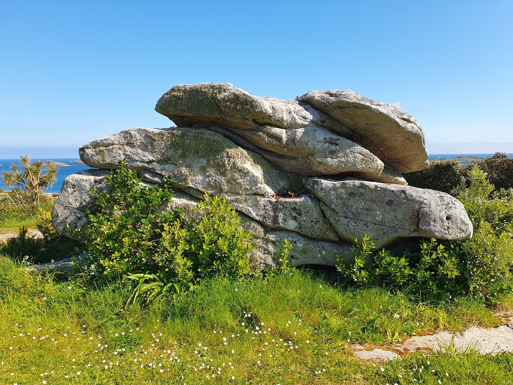
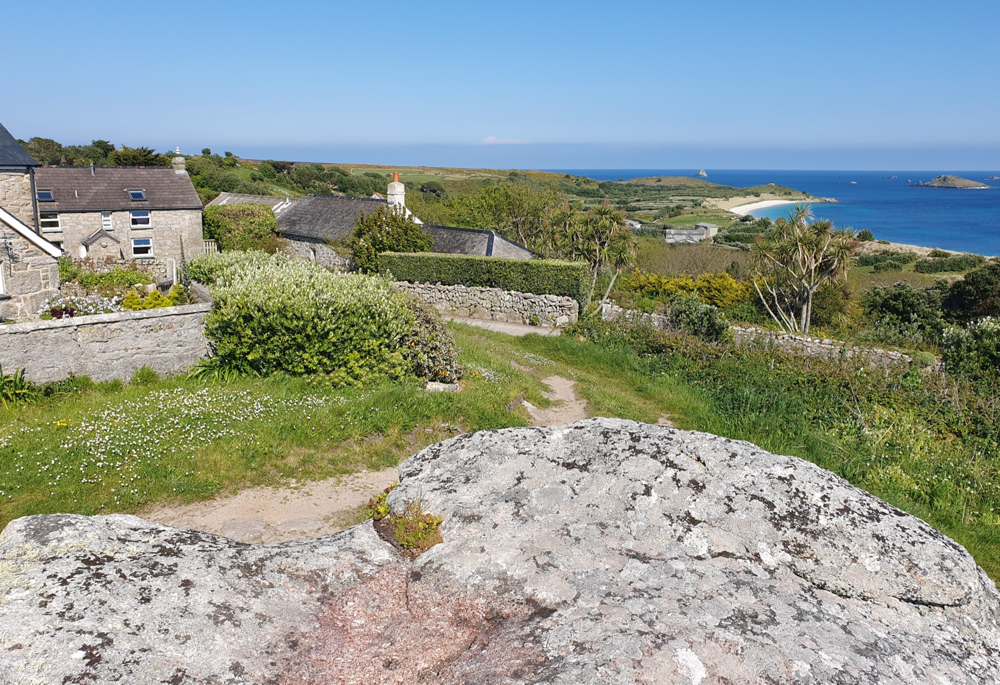
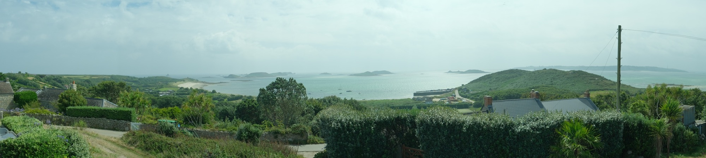
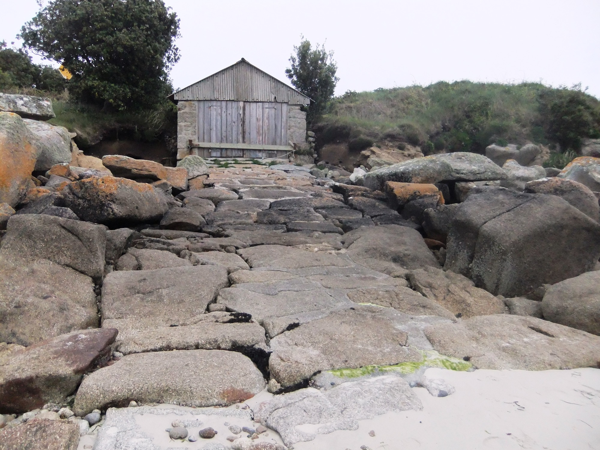
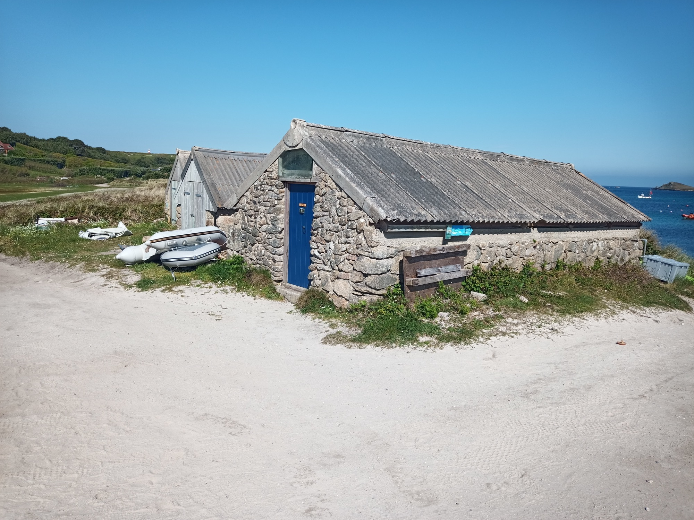
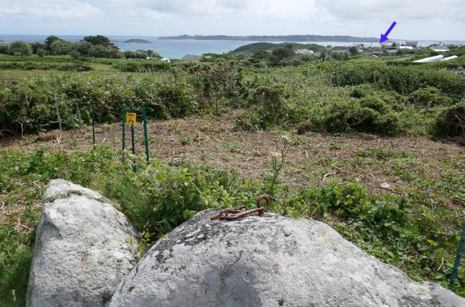
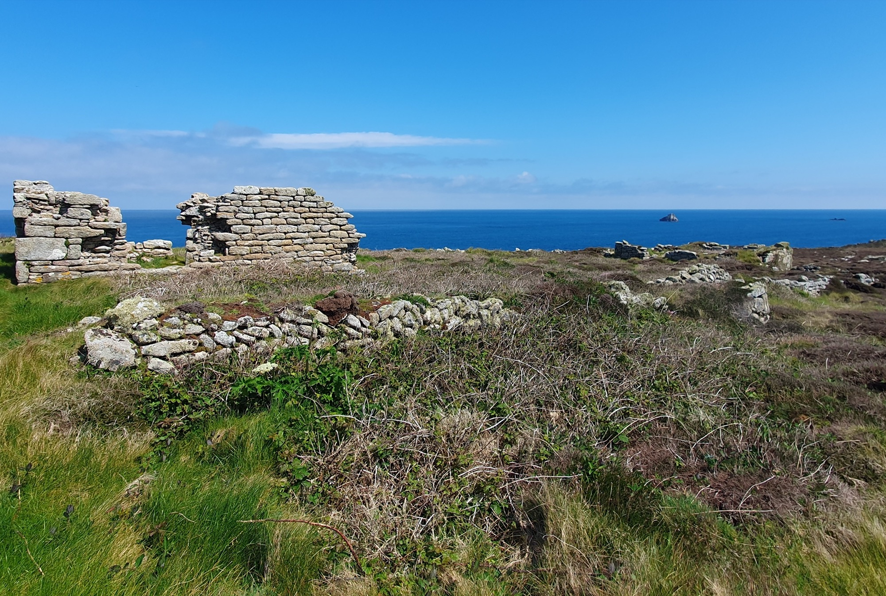
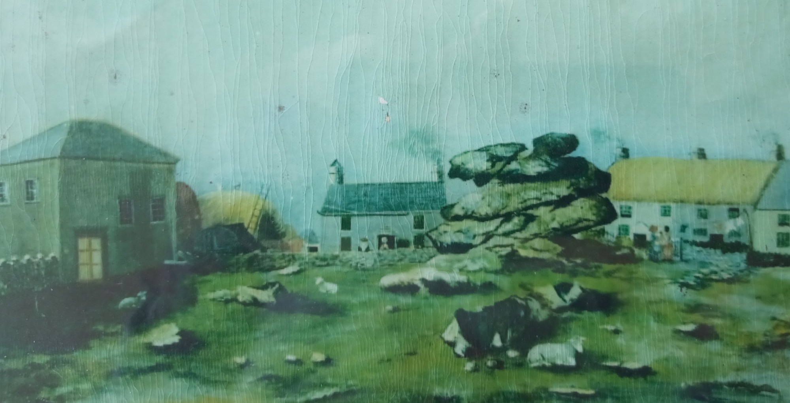
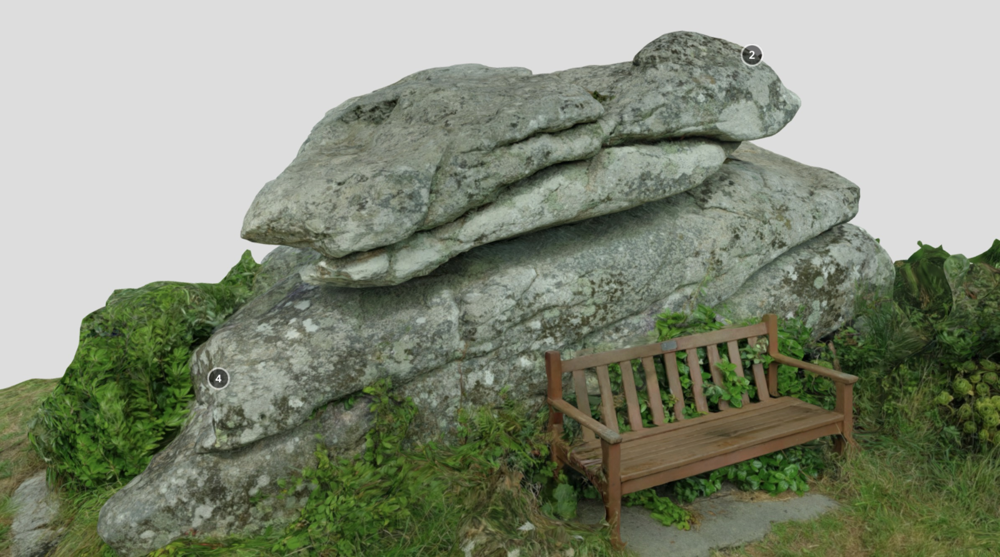

**Porths and Gigs of the Isles of Scilly: [Home](index.md) &#124; [The Project](project.md) &#124; [Around Hugh Town](around-hugh-town.md) &#124; [Innisidgen, St Mary's](innisidgen-st-marys.md) &#124; [New Quay, St Mary's](new-quay-st-marys.md) &#124; [Peraskin, Agnes](peraskin-st-agnes.md) &#124; [Great Par, Bryher](great-par-bryher.md) &#124; [Beacon Hill, Tresco](beacon-hill-tresco.md) &#124; [Signal Rock, St Martin's](signal-rock-st-martins.md)** 

# Signal Rock, St Martin’s
## Ancient lookout and meeting place, on a rock outcrop

Signal Rock, a carn on the high ground of St Martin’s at Higher Town (**Photo 1**), was once called News Rock. It was recorded in the late 18th century as - 

> ‘…. a rock, called News Rock, at which the inhabitants meet every day, in fine weather or foul, to tell and hear news ….’
> 
> (Troutbeck 1796, 13). 

_1: Signal Rock, formerly called News Rock, in the green at Higher Town by the road to St Martin’s main quay._

As noted in an early guidebook, the site was formerly a pilot lookout, as well as a meeting place;

> ‘Here is the “Rock”, a prehistoric remnant: the village look-out, and in times past the favourite meeting place of the elders …. There is a grand outlook from here, where in the old sailing ship days vessels wanting a pilot were quickly seen’
> 
> (Gibson and Sons c.1931, 89-90).

The Rock will have been a natural lookout and gathering place from ancient times. Its top, fairly flat, gives enough elevation to see across St Martin’s, and out to other islands and the open sea (**Photo 2**). It is surrounded by a green, so that the houses stand back from it. Formerly all island homes were single-storey, and trees were few, so the view will have reached even further.

_2: View from Signal Rock. The Daymark of 1683 stands on the skyline, above the chimney of one of the houses set back from the green, Hillside (mapped in 1792). It was given stripes in 1830 after a wreck when it was tragically mistaken for the contemporary St Agnes’ lighthouse._

The panorama from here takes in Par Beach (Higher Town Bay) with the main modern quay of St Martin’s, and the coastal slope just above Old Quay, both formerly bases for pilotage (**Photo 3**).

_3: Panorama to the east and south seen from Signal Rock. Gigs were kept on the porths below, lying either side of Cruther’s or Gullis Hill (right), near St Martin’s new and old quays._

Old Quay was already used by gigs in 1792 when it was mapped with a shed behind it, one of those surviving as ruins towards the south in the group. Other sheds including that on the north with its stone slab slipway and drang were mapped in 1888 (**Photo 4**). The site is linked to _Linnet_, one of the many historic gigs that do not survive (as discussed in the project report).

_4: Re-roofed shed with paved slip to the north in a group at St Martin’s Old Quay, where the 1792 and 1888 maps, and ruins, indicate half a dozen gig shed sites, some of different phases._

Par Beach is the site of a remarkable long-lived and long-adapted row of sheds (also discussed further in the project report). The 1830 gigs still in use, _Bonnet_ and _Slippen_ (then called _Bernice_), were once here. The row mapped in 1888 included at least 4 sheds made for gigs, as their dimensions show. All were east of the sheds standing today, the western one of which, however, is a historic building, dating from later in the era of pilotage. There was also a gig shed further west again. Part of its stonework is visible under the sand dunes, just across the sand slipway from the standing sheds (thanks to Steve Walder for information) (**Photo 5**).

_5: Sheds at Par Beach, St Martin’s. The nearest is a pilot gig shed of c.1900; the next, the more recent shed of the 2001 gig Galatea, and the third is another modern shed housing the Dolphin of 1969 (replacing a shorter shed of c.1900). There were formerly other sheds, to either side; the largest ever gig, Queen, is still recalled as having been housed just left (east) of these standing ones (Steve Walder, pers. comm) and the 1888 map shows a shed there 34 feet long._

Troutbeck in 1796 also mentions another vantage point on the high ground of St Martin’s, which at that time was still in use as one of the pilots’ lookouts;

> ‘About three furlongs [or 603m] from the church N.E. is a circle of stones twenty-four feet diameter, called the Guard-house, upon high ground, where pilots meet to look out for ships; here was formerly a small house, where soldiers, in the reign of Queen Anne (1702-1714) kept watch, which is now demolished, and the materials carried off.’

The Guard House was across the island, at Turfy Hill, also known as Flagstaff Hill (c.360m rather than 603m ENE of the church). The OS map of 1888 shows its old circular base there, plus a Coastguard Service lookout, with its flagstaff marked as a dot, still in use at that time. Flagstaff and Signal Rock are inter-visible (**Photo 6**). Messages could have been passed between them, potentially by the ancient method of ‘swaysing’ or waving a jacket or cap as well as by flags.

_6: Fixings for the stays of a flagstaff at a Victorian coastguard lookout at Flagstaff near Turfy Hill, St Martin’s, on a stone potentially deriving from an early 18th century military watch house here. Watchers here and at Signal Rock (arrowed) could have exchanged messages across the island._

Signal Rock is also one of three places in the area with evidence of flag signal poles, as the 3D model shows. The third was on Chapel Down to the east, at a ruined Admiralty signal station (**Photo 7**). The station is now part of an extensive Scheduled Monument. It was operated before 1815, when it was superseded by a semaphore mast at the Telegraph tower on St Mary’s.

_7: Napoleonic signal station at Chapel Down at the east end of St Martin’s, with ruins of lodgings and stores including for the signal flags. The outlying rock seen beyond, Hanjague, is one of many on the east and west of Scilly where gigs attended shipwrecks as well as providing pilotage._

There is no record of a flagstaff at Signal Rock on the OS maps of 1888 and 1906. A painting of the site c.1836-1881 (part of a heritage display nearby in the Sunday School of the Chapel) does not show it (**Photo 8**). There may have been a pilot signal mast here, like that documented at Beacon Hill, Tresco, come and gone before the middle decades of the 19th century ─ or a short-lived Coastguard staff, either of that time or shortly after 1906 as it wasn’t mentioned in 1932.

_8: Signal Rock or News Rock c.1836-1881, as shown in a painting included in a display of images of island heritage at the (later) Sunday School extension to the Chapel on the left. Reproduced thanks to the St Martin’s Methodist Church members and to Mandy Williams._

## 3D model

[View the 3D model on Sketchfab](https://sketchfab.com/3d-models/signal-rock-st-martins-isles-of-scilly-f9f50d327c924f32ab3f78fea9f0979b) where you can click the annotations to find out more about the different parts of the complex. The annotations are included below for reference.

**(1)** A feature in the face of the carn, on the north side less often exposed to gales, appears to be an old cut. This is a vertical, regular groove running down from the top, near the centre. It passes through several natural layers of rock, crossing the joint between them, to end at a small ledge below. On sunny days it is picked out clearly when the light catches it from one side. 

In view of the name Signal Rock, this is interpreted as a slot made to allow a flag staff to stand on the ledge half way down the rock. The carn would then have helped to raise and support the pole, and to shelter an operator of the signal who could have stood in the lee of it.

If a staff was fitted here, it may have been a re-used timber from a ship, salvaged from the shore or from a wreck. Wreck timber was traditionally used for all purposes requiring wood in buildings on Scilly, where ceiling beams are often round- or half-round in section, indicating use of ships’ masts or spars similar in breadth to this slot. 

**(2)** Drill holes suitable for fixings (rather than splitting) are visible on the Rock, at least two on the north side and two on the top. In places their edges appear slightly faceted rather than round, perhaps because they are the result of a particular style of hand drilling.

The hole at this point (2) has rusty remains of an iron fixture inside it. It is likely that this was a loop or hook used for securing a cable, to serve, along with more irons once fixed in the other holes, as a stay for a signal staff held against the north face of the carn. Well-preserved ironwork of this kind survives still fixed on a rock at the Coastguard lookout of at Flagstaff Hill on the other side of St Martin’s. 

Iron was wrought at Hugh Town, for use on Scilly and on the ships that were built and supplied here on a large scale in Victorian times. The OS maps of 1887 and 1906 show a smithy beside Town Beach at the east end of Thoroughfare (with a double gig shed beside it), on the site where Golden Bay Mansions now stands.

**(3)** Two pairs of initials, FN and RE, are cut in the Rock at this point, though they are not clear on the model (due to light conditions; much of the project scanning happened to be in bad weather!). As granite is not easily cut, this may be a reflection of time spent on watch here.

A small watch house stands at roughly the same height on the north east coast of St Mary’s at Mount Todden, within a Scheduled battery of the Civil War. This was used in watching the east approach to Scilly in times of danger, which will have been another function of Signal Rock from the deep past. The flat roof, made of lintels capped with turf for disguise like the islands’ Second World War ‘pillboxes’, offers a lookout platform similar to Signal Rock’s.

A massive rock slab forms one wall of the watch house. Inside, carved on the slab, are initials, dates, a flag, and other graffiti, made from Napoleonic times to the Great War. A shallow ledge, perhaps trimmed for the purpose, is just large enough to hold a small light.

**(4)** The top of the Rock is not readily accessible. The south west corner has a sloping shelf cut into it (with a drilled hole near its south end). This is rather too wide and sloping to be an early step, is not worn, and doesn’t lead on higher ones. It was probably cut to obtain a piece of stone.

The painting of the site as seen from the south, made before 1881, shows more rock outcrops on the Green. Moorstones obtained from here are likely to have been used as material for the building of the nearby Chapel in 1822, its re-building in 1836, and its Sunday School extension in 1881. There is bedrock beside Signal Rock at ground level, on the north; possibly it once rose higher and had a natural shape or cut footholds that could be used in climbing up the carn.

Moorstones may also have been used to sit and study the view, like the wooden bench today. Some Cornish harbours have walls or rock ledges at vantage points, once used as seats by neighbourhood groups. Both seats and groups had a dialect name, ‘gow’.

## Sources

* Gibson and Sons, c.1932 (undated). _The Isles of Scilly_. Gibson & Sons: Isles of Scilly
* Troutbeck, J, 1796. _A Survey of the Ancient and Present State of the Scilly Islands_: Sherborne

**Porths and Gigs of the Isles of Scilly: [Home](index.md) &#124; [The Project](project.md) &#124; [Around Hugh Town](around-hugh-town.md) &#124; [Innisidgen, St Mary's](innisidgen-st-marys.md) &#124; [New Quay, St Mary's](new-quay-st-marys.md) &#124; [Peraskin, Agnes](peraskin-st-agnes.md) &#124; [Great Par, Bryher](great-par-bryher.md) &#124; [Beacon Hill, Tresco](beacon-hill-tresco.md) &#124; [Signal Rock, St Martin's](signal-rock-st-martins.md)** 
